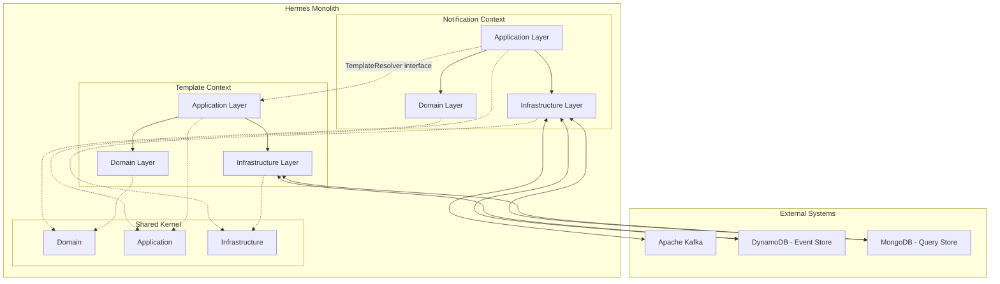

# Architecture Specification

## 1. Overview
Hermes is a multi-channel notification service built as a **Modular Monolith**. It follows **Domain-Driven Design (DDD)**, **CQRS**, **Event Sourcing**, and **Hexagonal Architecture** principles.

The system is partitioned into independent **Bounded Contexts** that communicate through explicit interfaces, ensuring high cohesion and low coupling.

## 2. Bounded Contexts

### Notification Context
Manages the lifecycle of a notification, from creation to delivery tracking.
- **Key Aggregates**: `Notification`
- **Responsibilities**: Validating notification requests, persisting state changes as events, and coordinating delivery through external providers.

### Template Context
Handles the management and rendering of message templates.
- **Key Aggregates**: `Template`
- **Responsibilities**: Storing template definitions and rendering them using provided context data.

### Shared Kernel
Contains the common technical and domain building blocks used by all contexts.
- **Contents**: `BaseEntity`, `DomainEvent`, `BaseError`, CQRS interfaces, and global configuration.

## 3. System Architecture

## 4. Key Architectural Patterns

### Hexagonal Architecture (Ports & Adapters)
Each context is organized into three layers:
1. **Domain**: Pure business logic, entities, and port interfaces. No external dependencies.
2. **Application**: CQRS command/query handlers and event projectors.
3. **Infrastructure**: Framework-specific implementations (REST controllers, DB adapters, Kafka consumers).

### Event Sourcing
The "Write Side" (DynamoDB) stores the full history of state changes as an append-only sequence of events. The current state of an aggregate is reconstituted by replaying these events.

### CQRS (Command Query Responsibility Segregation)
- **Commands**: Modify state via the Event Store (DynamoDB).
- **Queries**: Read state from denormalized views (MongoDB).
- **Projectors**: Asynchronously update the Read Side based on events published to Kafka.

### Functional Error Handling
The system uses **Arrow-kt**'s `Either` type to handle errors as values, avoiding exceptions in the domain and application layers.

## 5. Technology Stack
- **Language**: Kotlin 2.2 (JVM 21)
- **Framework**: Quarkus 3.30
- **Persistence**: Amazon DynamoDB (Write), MongoDB (Read)
- **Messaging**: Apache Kafka (Internal Bus)
- **Functional**: Arrow-kt
- **Observability**: OpenTelemetry
