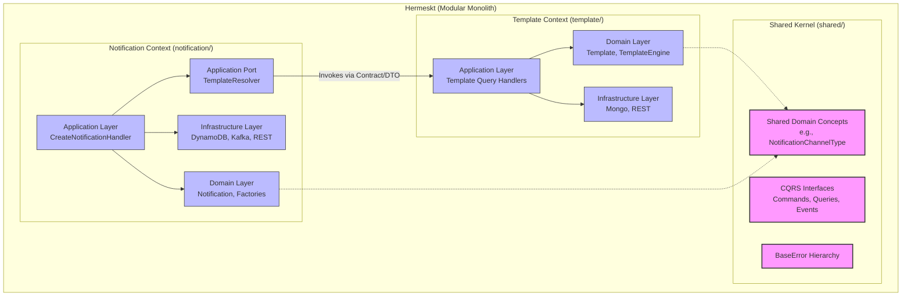

# Architecture Specification: Final Adjustments for Modular Monolith

## 1. Epic Architecture Overview
The `final-adjustments-modular-monolith` epic completes the architectural transition of the Hermeskt project into a strict Modular Monolith. The goal is to completely sever any lingering direct domain-to-domain or application-to-domain dependencies between the `notification` and `template` bounded contexts. This will be accomplished by elevating shared domain concepts to the `shared/domain` kernel and establishing explicit, strict application-level contracts (interfaces/ports) for inter-module communication, ensuring one context never relies on the internal implementation details of another.

## 2. System Architecture Diagram

## 3. High-Level Features & Technical Enablers

### High-Level Features
1. **Promote NotificationType:** Extract `NotificationType` from `notification/domain` and move it to `shared/domain` (potentially renaming it to `ChannelType` or similar). Update all references in both contexts.
2. **Abstract TemplateEngine:** Remove the direct injection of `TemplateEngine` inside `CreateNotificationHandler`.
3. **Define Inter-Module Port:** Create an explicit outbound port (e.g., `TemplateResolver` interface) in the `notification/application` layer.
4. **Implement Inter-Module Adapter:** Create an adapter in the `notification/infrastructure` layer (or directly in the application layer if following a simpler facade pattern) that implements the port by calling the `template` context's designated Application Service/Query Handler, using only primitive types or DTOs.

### Technical Enablers
- **Kotlin Refactoring & Imports:** Safely moving classes and organizing imports to ensure no `template.domain` leaks into `notification`.
- **Arrow-kt integration:** Ensuring the new `TemplateResolver` port continues to return `Either<BaseError, ResolvedTemplateDto>`.
- **Dependency Injection (CDI/Quarkus):** Correctly wiring the new Adapter so that `@ApplicationScoped` beans resolve the new port interface.

## 4. Technology Stack
- **Language**: Kotlin 2.2
- **Framework**: Quarkus 3.30
- **Functional Paradigm**: Arrow-kt (`Either`, `either { }`)
- **Architecture**: Modular Monolith, Hexagonal Architecture, DDD
- **Build System**: Maven

## 5. Technical Value
**High**. This epic delivers the final promise of the Modular Monolith: true isolation. By completely decoupling the contexts, development teams can iterate on the Template rendering engine or Notification delivery mechanisms in complete isolation. It drastically reduces the risk of regression bugs caused by tangled dependencies and prepares the application for effortless extraction into microservices if scaling demands dictate it in the future.

## 6. T-Shirt Size Estimate
**Small (S)**
The work is entirely structural (refactoring code, moving classes, updating tests). There are no new infrastructure components, databases, or external APIs to integrate. 
