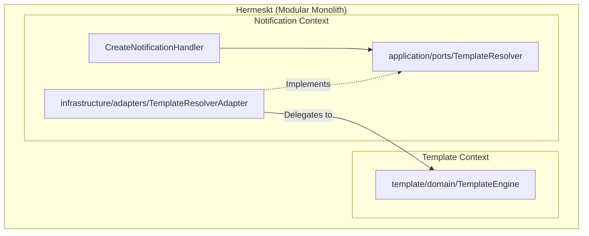

# Implementation Plan: Decouple Notification Template Handler

## Goal
Introduce an explicit application port (contract/interface) in the `notification` context (e.g., `TemplateResolverPort`) and implement it via an Adapter that delegates to the `template` context. This removes the direct dependency on `TemplateEngine` from `CreateNotificationHandler`, ensuring full encapsulation and loose coupling between the bounds.

## Requirements
- Create `TemplateResolver` port interface in `notification/application/ports`.
- Create a DTO `ResolvedTemplateDto` (or use primitives) for the return type of the port.
- Refactor `CreateNotificationHandler` to use the `TemplateResolver` port instead of `TemplateEngine` directly.
- Provide a CDI `@ApplicationScoped` implementation of `TemplateResolver` (the Adapter) that calls `template`'s `TemplateEngine`. (Later, if we want strict decoupling, the `template` context could have a formal Application Service / Query Handler for this, but calling the `TemplateEngine` from an Adapter in `notification` respects the Dependency Inversion Principle as the Application layer of `notification` no longer knows about it).

## Technical Considerations

### System Architecture Overview



- **Technology Stack Selection**: Kotlin 2.2, Arrow-kt (Port returns `Either<BaseError, ResolvedTemplateDto>`).
- **Integration Points**: The new `TemplateResolverAdapter` depends on `TemplateEngine` from the `template` context. This acts as an Anti-Corruption Layer (ACL) or at least a strict boundary adapter. The rest of the `notification` context is completely decoupled from `template`.
- **Deployment Architecture**: Unified Quarkus executable.

### Component Structure & API Design
1. **Define DTO & Port in `notification`:**
   ```kotlin
   // notification/application/ports/TemplateResolver.kt
   data class ResolvedTemplateDto(val subject: String?, val body: String)
   
   interface TemplateResolver {
       fun resolve(
           templateName: String, 
           channel: NotificationChannelType, 
           payload: Map<String, Any>
       ): Either<BaseError, ResolvedTemplateDto>
   }
   ```
2. **Refactor Handler:**
   Update `CreateNotificationHandler` constructor to take `TemplateResolver` instead of `TemplateEngine`. Change the internal logic to use `ResolvedTemplateDto`. Remove `TemplateName` value object imports (instantiate primitive strings instead).
3. **Implement Adapter:**
   Create `TemplateResolverAdapter` in `notification/infrastructure/adapters` (or a dedicated integration package if one exists, e.g., `notification/infrastructure/integration`).
   ```kotlin
   // notification/infrastructure/integration/TemplateResolverAdapter.kt
   @ApplicationScoped
   class TemplateResolverAdapter(
       private val templateEngine: TemplateEngine // Dependency on template context
   ) : TemplateResolver {
       override fun resolve(...) {
           // map primitives to template value objects
           // call templateEngine.resolve(...)
           // map result back to ResolvedTemplateDto
       }
   }
   ```

### Database & Scaling
- No database schema changes.
- Performance is unaffected as it remains a synchronous, in-process method call.

### Security
- No changes to security models. Payload interpolation rules remain identical.
