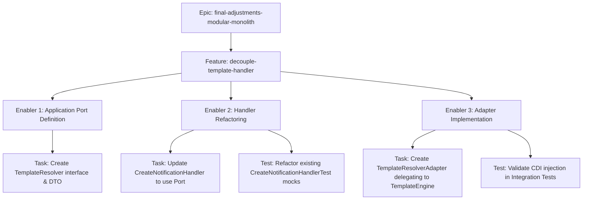

# Project Plan: Decouple Notification Template Handler

## 1. Project Overview
- **Feature Summary**: Refactor the `CreateNotificationHandler` to eliminate the direct dependency on `TemplateEngine` from the `template` context. Introduces an explicit `TemplateResolver` Application Port and an Adapter.
- **Success Criteria**: 0 imports from `template.domain.services` inside `notification.application`. `TemplateEngine` is only used inside the Adapter or `template` context.
- **Key Milestones**: Create Port interface, Refactor Handler, Create Adapter, Update mock tests.
- **Risk Assessment**: Moderate risk. Ensuring the Adapter safely delegates and correctly maps Arrow-kt's `Either` across boundaries requires care, but is fully covered by current integration tests.

## 2. Work Item Hierarchy


## 3. GitHub Issues Breakdown

### Epic Issue Template
> Included in the main epic tracking mechanism. Reference `#final-adjustments-modular-monolith`.

### Feature Issue
```markdown
# Feature: Decouple Notification Template Handler

## Feature Description
The `notification` bounded context injects `TemplateEngine` directly. Introduce an explicit application port (contract/interface) in the `notification` context (e.g., `TemplateResolverPort`) and implement it via an Adapter that delegates to the `template` context.

## Technical Enablers
- [ ] #102 - Application Port Definition
- [ ] #103 - Handler Refactoring
- [ ] #104 - Adapter Implementation

## Dependencies
**Blocks**: None

## Acceptance Criteria
- [ ] `CreateNotificationHandler` uses `TemplateResolver` interface.
- [ ] `TemplateResolverAdapter` successfully delegates to `TemplateEngine`.
- [ ] Zero domain leaked imports across contexts in application layers.

## Definition of Done
- [ ] All technical enablers completed
- [ ] Unit and Integration testing passed

## Labels
`feature`, `P1`, `High`, `architectural-refactoring`

## Epic
#final-adjustments-modular-monolith

## Estimate
S
```

### Technical Enabler 1: Port Definition
```markdown
# Technical Enabler: Application Port Definition

## Enabler Description
Establish the formal boundary/contract in the `notification` application layer.

## Technical Requirements
- [ ] Create `ResolvedTemplateDto`
- [ ] Create `TemplateResolver` interface returning `Either<BaseError, ResolvedTemplateDto>`

## Implementation Tasks
- [ ] #102-A - Create interfaces and models in `notification/application/ports/`

## Acceptance Criteria
- [ ] Interfaces compile successfully. No `template` domain imports utilized in the port definitions.

## Labels
`enabler`, `P1`, `contract`

## Estimate
1 point
```

### Technical Enabler 2: Handler Refactoring
```markdown
# Technical Enabler: Handler Refactoring

## Enabler Description
Update `CreateNotificationHandler` to depend exclusively on `TemplateResolver`.

## Technical Requirements
- [ ] Modify `CreateNotificationHandler` constructor.
- [ ] Change logic to process `ResolvedTemplateDto` instead of direct template concepts.

## Implementation Tasks
- [ ] #103-A - Refactor handler implementation.
- [ ] #103-B - Update `CreateNotificationHandlerTest` to mock `TemplateResolver` instead of `TemplateEngine`.

## Acceptance Criteria
- [ ] Unit tests pass natively.

## Labels
`enabler`, `P1`, `refactoring`

## Estimate
3 points
```

### Technical Enabler 3: Adapter Implementation
```markdown
# Technical Enabler: Adapter Implementation

## Enabler Description
Bridge the port to the `template` context via a new Adapter.

## Technical Requirements
- [ ] Wire `@ApplicationScoped` implementation of `TemplateResolver`.
- [ ] Inject `TemplateEngine` to safely delegate calls.

## Implementation Tasks
- [ ] #104-A - Implement `TemplateResolverAdapter` in `notification/infrastructure`.

## Acceptance Criteria
- [ ] Application starts successfully with CDI wiring the interface correctly.
- [ ] E2E/Integration tests pass.

## Labels
`enabler`, `P1`, `adapter`

## Estimate
2 points
```

## 4. Priority and Value Matrix
| Priority | Value  | Criteria                        | Labels                            |
| -------- | ------ | ------------------------------- | --------------------------------- |
| P1       | High   | Core architectural requirement  | `priority-high`, `value-high`     |

## 5. Estimation Guidelines
- Total feature: ~6 story points (Small/Medium).

## 6. Dependency Management
This feature can be started independently but the full scope validation might rely on `extract-shared-concepts` completely finishing. Validations and E2E Integration tests should happen chronologically after both refactorings are merged.
