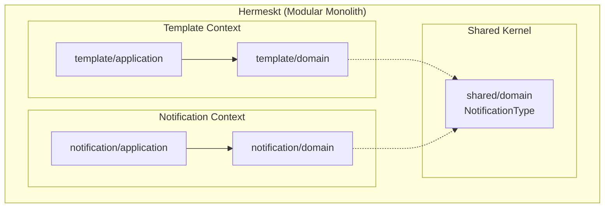

# Implementation Plan: Extract Shared Domain Concepts

## Goal
Extract common building blocks like `NotificationType` from the `notification` context and promote them to the `shared/domain` kernel boundaries. This resolves the cross-boundary dependency that currently breaks the isolation principle of a modular monolith, allowing both contexts to safely rely on the shared kernel without knowing about each other’s internal domains.

## Requirements
- Move `br.com.olympus.hermes.notification.domain.factories.NotificationType` to `br.com.olympus.hermes.shared.domain.core.NotificationChannelType` (or keep the name `NotificationType` in the `shared/domain.core` package).
- Refactor all usages across `notification` and `template` contexts (including Kafka serialization, MongoDB reading, DynamoDB schemas).
- Ensure zero behavioral/functional changes.

## Technical Considerations

### System Architecture Overview

- **Technology Stack Selection**: Kotlin 2.2, Arrow-kt.
- **Integration Points**: Both `template` and `notification` contexts will import from `shared/domain/core`.
- **Deployment Architecture**: No changes; still deployed as a single Quarkus executable.
- **Scalability Considerations**: Moving an enum has no runtime performance impact. It purely improves logical scalability for the developers.

### Database Schema Design
- **No Schema Changes:** The enum string values serialized into MongoDB (via Panache) and DynamoDB (via Enhanced Client) must remain identical (e.g., `"EMAIL"`, `"SMS"`).
- We may need to verify that `@BsonProperty` or DynamoDB `@DynamoDbAttribute` annotations are respected if the class moves, though generally, serialization defaults to the enum's `name()` which remains unchanged.

### API Design
- **No API Changes:** Existing REST endpoints (e.g., `POST /api/v1/notifications`) will continue to accept the same JSON payloads. We must ensure Jackson continues to deserialize the string `"EMAIL"` into the relocated `NotificationType` enum.

### Component Changes
1. **Move File**: Move `src/main/kotlin/br/com/olympus/hermes/notification/domain/factories/NotificationType.kt` to `src/main/kotlin/br/com/olympus/hermes/shared/domain/core/NotificationType.kt` (adjusting package name).
2. **Global Refactor**: Update imports in `notification` context:
    - `CreateNotificationCommand`
    - `NotificationFactoryRegistry`
    - `Notification` (and subclasses)
    - MongoDB/DynamoDB entities
    - Kafka DTOs
3. **Global Refactor**: Update imports in `template` context:
    - `NotificationTemplate`
    - `TemplateEngine`
    - MongoDB Repository implementations
    - Application Commands/Queries
4. **Tests Update**: Refactor imports in all `src/test/kotlin` files.

### Security & Performance
- N/A. This is a structural refactoring with no security or performance implications.
