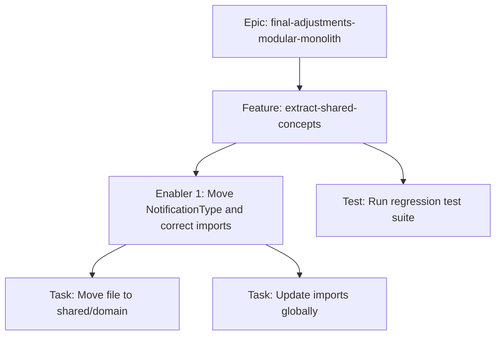

# Project Plan: Extract Shared Domain Concepts

## 1. Project Overview
- **Feature Summary**: Relocates `NotificationType` from the `notification` boundary to the `shared/domain` kernel to eliminate direct circular dependencies between `notification` and `template` contexts.
- **Success Criteria**: 0 imports from `notification.domain` inside `template`. All tests pass. Build succeeds.
- **Key Milestones**: Move class, Refactor imports, Run regression suite.
- **Risk Assessment**: Very low risk. purely structural refactoring.

## 2. Work Item Hierarchy


## 3. GitHub Issues Breakdown

### Epic Issue Template
> Included in the main epic tracking mechanism. Reference `#final-adjustments-modular-monolith`.

### Feature Issue
```markdown
# Feature: Extract Shared Domain Concepts

## Feature Description
Building blocks like `NotificationType` are currently defined inside the `notification` domain. Extract these common blocks and schemas to the `shared/domain` kernel.

## Technical Enablers
- [ ] #101 - Move NotificationType to Shared Kernel

## Dependencies
**Blocks**: Decouple Notification Template Handler (partially)

## Acceptance Criteria
- [ ] `NotificationType` residues in `shared/domain`.
- [ ] 0 cross-boundary domain imports for this class.

## Definition of Done
- [ ] Technical enablers completed
- [ ] Integration testing passed

## Labels
`feature`, `P1`, `High`, `architectural-refactoring`

## Epic
#final-adjustments-modular-monolith

## Estimate
S
```

### Technical Enabler: Move NotificationType
```markdown
# Technical Enabler: Move NotificationType to Shared Kernel

## Enabler Description
Moves the enum and fixes all corresponding imports across the entire workspace.

## Technical Requirements
- [ ] Move `NotificationType.kt` to `src/main/kotlin/br/com/olympus/hermes/shared/domain/core/`
- [ ] Update package declaration

## Implementation Tasks
- [ ] #101-A - Execute file move
- [ ] #101-B - Global search and replace of imports

## Acceptance Criteria
- [ ] `./mvnw clean compile` passes.

## Definition of Done
- [ ] Implementation completed
- [ ] Tests passing
- [ ] Code review approved

## Labels
`enabler`, `P1`, `refactoring`, `shared-kernel`

## Feature
#extract-shared-concepts

## Estimate
1 point
```

## 4. Priority and Value Matrix
| Priority | Value  | Criteria                        | Labels                            |
| -------- | ------ | ------------------------------- | --------------------------------- |
| P1       | High   | Core architectural requirement  | `priority-high`, `value-high`     |

## 5. Estimation Guidelines
- Enabler: 1 point (trivial file move and import fix).

## 6. Dependency Management
This feature has no prerequisites. It can be developed in parallel with or before `decouple-template-handler`.
