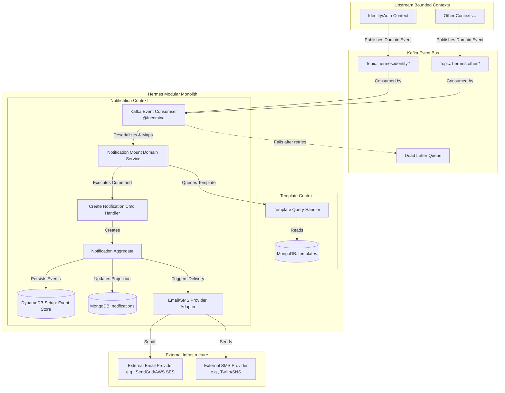

# Epic Architecture Specification: mount-notifications

## 1. Epic Architecture Overview

The `mount-notifications` epic focuses on building an event-driven mechanism to consume domain events, populate notification templates, and dispatch the formatted messages. The architecture leverages the existing **Hermes** project stack (Kotlin, Quarkus, Domain-Driven Design, Hexagonal Architecture).

The core flow involves a new set of Kafka consumers in the `notification` bounded context (or a dedicated `delivery` context if deemed necessary, but we'll assume it fits within `notification` for now as a core capability). These consumers will listen to specific upstream topics (e.g., `hermes.identity.user-2fa-requested`), load the corresponding `Template` (from the `template` context via an internal application service or read model), parse the variables against the event payload, create a `Notification` aggregate (recording the intent to send), and finally dispatch it via a standard output port (to an external provider like AWS SES or Twilio).

## 2. System Architecture Diagram

## 3. High-Level Features & Technical Enablers

**High-Level Features:**
1. **f1-event-listener-infrastructure**: Basic Kafka consumer setup with SmallRye messaging to listen to generic domain events.
2. **f2-template-mounting-engine**: A domain service that takes an event payload (JSON/Map) and a `Template` string, and resolves placeholders securely.
3. **f3-notification-dispatch-flow**: The command handler flow that records the notification request (creating a `Notification` aggregate) and hands it off to an output port for provider delivery.

**Technical Enablers:**
- **Kafka Dead Letter Queue (DLQ) Configuration**: Ensure `mp.messaging.incoming.<channel>.failure-strategy=dead-letter-queue` is set for all consumers.
- **Event-to-Template Mapping Configuration**: A mechanism (config file or DB table) to map an incoming Kafka topic/event type to a specific `Template` ID.
- **Resilience4j / Fault Tolerance**: Retries and circuit breakers on the external provider adapters (Email/SMS).

## 4. Technology Stack

- **Language:** Kotlin 2.2 (JVM 21)
- **Framework:** Quarkus 3.30
- **Messaging:** Apache Kafka (SmallRye Reactive Messaging)
- **Error Handling:** Arrow-kt (Functional error handling, `Either`)
- **Persistence (Write):** Amazon DynamoDB Enhanced Client (Event Soucing)
- **Persistence (Read):** MongoDB with Panache (Projections)
- **Templating Engine:** TBD (could be simple string replacement, or a lightweight library like Apache FreeMarker, Pebble, or Mustache depending on complexity needs).
- **Observability:** OpenTelemetry (Traces for the end-to-end flow).

## 5. Technical Value

**High**. 
This epic implements the core value proposition of the `Hermes` system: acting as the central nervous system for reactive communication. Implementing this correctly with idempotency, DLQs, and robust error handling is crucial for the reliability of the entire platform.

## 6. T-Shirt Size Estimate

**L (Large)**. 
Requires setting up robust Kafka consumers, cross-context interactions (fetching templates), potentially complex string/JSON parsing for the mounting engine, and ensuring the aggregate/event-sourcing flow works correctly under concurrent load.
