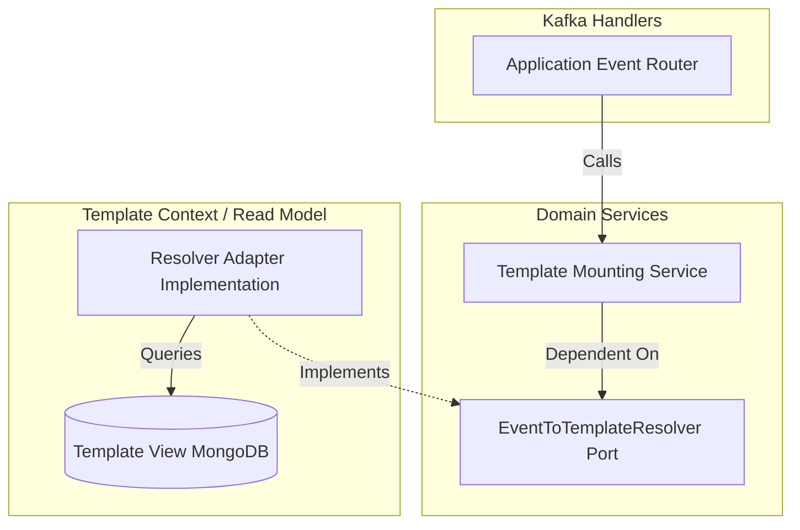

# Feature Implementation Plan: f2-template-mounting-engine

## Goal
Implement a highly performant and secure Domain Service capable of resolving an event to its structured Template, and then mounting (interpolating) the dynamic event payload into the text body of that Template.

## Requirements
- Define an interface (Domain Port) for `EventToTemplateResolver`.
- Implement a `TemplateMountingService` that accepts an Event/Map and a `Template`.
- Merge variables securely, handling nested values and missing values.
- Return the final mounted string.

## Technical Considerations

### System Architecture Overview



- **Technology Stack Selection**:
  - `Pebble` or `Mustache.java`: A lightweight, fast templating engine built for the JVM. Given Hermes is a modern Kotlin project, a typed engine like Pebble offers security features (auto-escaping) and speed advantageous for high-throughput notification systems. Alternatively, we could use native Kotlin `String.replace` and regex if we limit syntax to simple `{{variable}}`, but a dedicated library prevents edge case bugs.
  - Arrow-kt `Either`: Used strictly for returning `TemplateMountingError` extending `BaseError.ClientError` if a required variable is not found.
- **Integration Points**: Acts as a pure Domain Service. Called by the application layer. Dependend on an SPI port to fetch the template.

### Database Schema Design
*No specific database schema changes.* The `EventToTemplateResolver` will likely read from the existing `TemplateView` collection in MongoDB, looking up templates by an indexed `eventType` key (to be mapped via UI in the `template` context later).

### API Design
*Domain Service API (Internal Kotlin Interface):*

```kotlin
interface TemplateMountingService {
    fun mount(template: TemplateBody, payload: Map<String, Any?>): Either<MountingError, MountedContent>
}
```

### Frontend Architecture
*Not applicable. Backend core logic.*

### Security & Performance
- **Security**: 
  - Using a proven library like Pebble mitigates XSS and injection attacks by automatically escaping characters by default.
  - The payload must be treated as untrusted data during the mount phase.
- **Performance**:
  - The templating engine's instance must be cached/reused (e.g., `@ApplicationScoped` PebbleEngine) because initializing it per-message is expensive.
  - Compiled templates should leverage an internal LRU cache within the engine.
