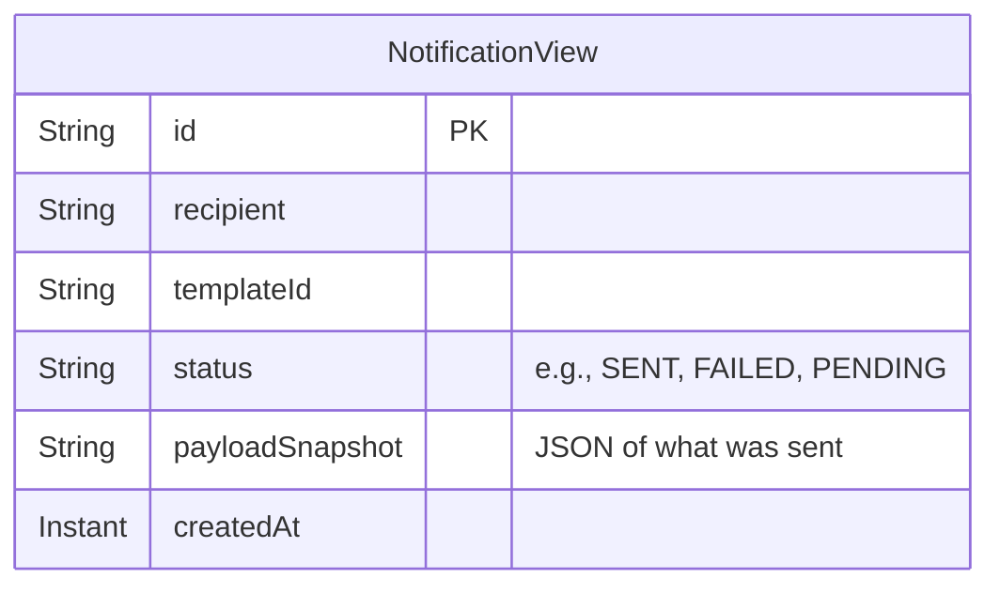

# Feature Implementation Plan: f3-notification-dispatch-flow

## Goal
Implement the CQRS Command flow for recording the intent to send a notification (creating the `Notification` aggregate), persisting it to DynamoDB, dispatching it via an external provider port, and projecting the event to MongoDB for read access.

## Requirements
- Create `CreateNotificationCommand` and `CreateNotificationHandler`.
- Create `Notification` AggregateRoot and `NotificationCreated` Event in the `domain` layer.
- Define `NotificationProviderPort` in `domain/ports/output`.
- Create a dummy/logging implementation of `NotificationProviderPort` in `infrastructure/providers`.
- Create `NotificationCreatedProjector` in `application/projectors`.
- Create `NotificationCreatedConsumer` in `infrastructure/messaging/consumers`.
- Create `NotificationView` Panache entity in `infrastructure/readmodel`.

## Technical Considerations

### System Architecture Overview

```mermaid
graph TD
    subgraph Notification Context
        
        subgraph Application Layer
            CmdHandler[CreateNotificationHandler]
            Projector[NotificationCreatedProjector]
        end

        subgraph Domain Layer
            Aggregate[Notification Aggregate]
            DomainEvent[NotificationCreated Event]
            ProviderPort[NotificationProviderPort]
        end

        subgraph Infrastructure Layer
            DynamoRepo[(DynamoDB:<br/>EventStoreTable)]
            MongoRepo[(MongoDB:<br/>notifications)]
            KafkaPublisher[Kafka Event Publisher]
            KafkaConsumer[@Incoming Consumer]
            ProviderAdapter[Logging/Dummy Provider Adapter]
        end
    end

    CmdHandler -- Creates --> Aggregate
    Aggregate -- Generates --> DomainEvent
    CmdHandler -- Persists --> DynamoRepo
    CmdHandler -- Dispatches --> ProviderPort
    ProviderAdapter -. Implements .-> ProviderPort
    
    CmdHandler -- Publishes --> KafkaPublisher
    KafkaPublisher -- To Topic --> KafkaConsumer
    KafkaConsumer -- Triggers --> Projector
    Projector -- Upserts --> MongoRepo
```

- **Technology Stack Selection**:
  - **DynamoDB Enhanced Client**: Used for the event store write layer.
  - **MongoDB Panache**: Used for the read model projection.
  - **SmallRye Kafka**: For publishing the `NotificationCreated` event so the projector can pick it up.
- **Integration Points**: 
  - Writes to DynamoDB.
  - Publishes to Kafka `hermes.notification.notification-created`.
  - Consumes from `hermes.notification.notification-created`.
  - Writes to MongoDB.
  - Calls downstream Provider Adapter.

### Database Schema Design

**DynamoDB (Write Side - Event Store)**
- standard single-table design (`PK` = notificationId, `SK` = version string).
- Event type: `NotificationCreated`.

**MongoDB (Read Side)**



### API Design
*Internal Application API (CQRS Command):*

```kotlin
data class CreateNotificationCommand(
    val id: String = UUID.randomUUID().toString(),
    val recipient: String,
    val templateId: String,
    val payload: Map<String, Any?>
) : Command

class CreateNotificationHandler(...) : CommandHandler<CreateNotificationCommand> {
    override fun handle(command: CreateNotificationCommand): Either<BaseError, Unit> {
        // 1. Create Aggregate
        // 2. Dispatch via port
        // 3. Persist to Dynamo
        // 4. Commit (publish Event)
    }
}
```

### Frontend Architecture
*Not applicable.*

### Security & Performance
- **Security**: The payload snapshot stored in MongoDB should ideally strip highly sensitive PII if not needed for auditing, though standard auditing usually requires full context. (Implementation detail for code phase).
- **Performance**: 
  - The `NotificationProviderPort` dispatch is synchronous in the handler for this first iteration to guarantee delivery status can be recorded. If the provider is slow, this blocks the handler.
  - *Mitigation*: The Provider Adapter should use asynchronous HTTP clients and Resilience4j timeouts to fail fast (e.g., within 2 seconds).
