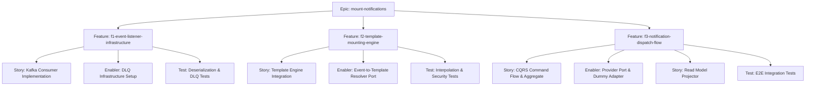
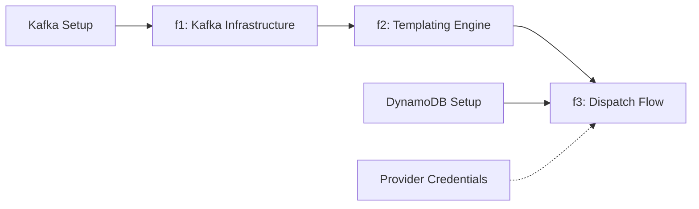

# Project Plan: mount-notifications

## 1. Project Overview

**Feature Summary**: 
The `mount-notifications` epic builds the core reactive communication engine for Hermes. It consumes upstream domain events from Kafka, interpolates their dynamic payloads into predefined templates, and durably records and dispatches the final messages (Email/SMS) to the end user.

**Success Criteria**:
- 95% of security/transactional notifications dispatched within 5 seconds.
- Delivery Success Rate > 99.9%.
- DLQ Rate < 0.1%.

**Key Milestones**:
- **Milestone 1**: Event Ingestion (Kafka consumer and DLQ setup).
- **Milestone 2**: Template Engine (Secure and performant string interpolation).
- **Milestone 3**: Dispatch & Audit Flow (CQRS command, DynamoDB persistence, read model, and external provider adapter).

**Risk Assessment**:
- *Performance bottlenecks in templating*: Mitigated by using a fast JVM template engine and caching compiled templates.
- *Kafka message loss*: Mitigated by strict at-least-once configuration and explicit DLQ routing on exceptions.
- *Third-party API downtime*: Mitigated by Resilience4j retries and tracking the failed status in the database for later reconciliation.

## 2. Work Item Hierarchy

## 3. GitHub Issues Breakdown

*(See `issues-checklist.md` for the exact issues to be created).*

## 4. Priority and Value Matrix

| Priority | Value  | Criteria                        | Feature |
| -------- | ------ | ------------------------------- | ------- |
| P0       | High   | Critical path, blocking flow    | f1-event-listener-infrastructure |
| P0       | High   | Core business logic             | f2-template-mounting-engine |
| P0       | High   | End-user delivery & durability  | f3-notification-dispatch-flow |

*All features in this initial epic are P0/High value as they form the foundational baseline of the Hermes notification engine.*

## 5. Estimation Summary

- **Epic T-Shirt Size**: L (Large)
- **f1-event-listener-infrastructure**: ~5 Story Points
- **f2-template-mounting-engine**: ~8 Story Points
- **f3-notification-dispatch-flow**: ~13 Story Points
- **Total Estimated Effort**: ~26 Story Points (Approx. 1-2 sprints for a standard team).

## 6. Dependency Management

**Constraints**: `f3` cannot be fully end-to-end tested without `f1` and `f2` being complete, although the internal CQRS handler for `f3` can be developed in parallel using mocked payloads.

## 7. Sprint Planning Template (Recommended)

### Sprint 1 Goal
**Primary Objective**: Establish the notification pipeline from ingestion to internal resolution.
**Stories in Sprint**:
- f1: Kafka Consumer & DLQ (5 pts)
- f2: Template Engine & Resolver (8 pts)

### Sprint 2 Goal
**Primary Objective**: Complete the domain aggregate, persistence, and external dispatch.
**Stories in Sprint**:
- f3: CQRS Command Flow & Aggregate (5 pts)
- f3: Provider Port & Adapter (3 pts)
- f3: Read Model Projector (5 pts)

## 8. GitHub Project Board Configuration
- **Columns**: Backlog, Sprint Ready, In Progress, In Review, Testing, Done.
- **Custom Fields**: Priority (P0), Component (Backend, Infra), Epic (mount-notifications).
