# Architecture Specification: Multi-Channel Notification Delivery with Template Engine

## 1. Epic Architecture Overview

This epic extends the existing Hermes notification service to become a full **notification delivery platform**. The architecture preserves the current **DDD / Hexagonal / CQRS / Event Sourcing** design and introduces three new cross-cutting concerns:

1. **Push Notification Channel** — a new aggregate, factory, events, and REST endpoint following the established Email/SMS/WhatsApp pattern.
2. **Template Engine** — a domain service that resolves named templates from MongoDB and interpolates `{{variable}}` placeholders against the caller-supplied `payload`, decoupling message content authoring from delivery logic.
3. **Delivery Pipeline** — an asynchronous delivery layer triggered by `NotificationCreatedEvent`s, delegating to channel-specific **provider adapters** (output ports) and publishing lifecycle events (`NotificationSentEvent`, `NotificationDeliveryFailedEvent`) back through Kafka.

The system remains a single Quarkus application (monolith modular) with clear hexagonal boundaries. All new components follow the existing package structure and coding conventions (Arrow-kt `Either`, constructor injection, `@JvmInline value class` VOs, sealed event hierarchies, etc.).

## 2. System Architecture Diagram

```mermaid
flowchart TB
    subgraph UserLayer["User Layer"]
        DEV["Platform Developer<br/>(REST Client)"]
        KAFKA_PROD["Upstream Services<br/>(Kafka Producers)"]
    end

    subgraph AppLayer["Application Layer — Quarkus"]
        subgraph REST["REST Controllers"]
            NC["NotificationController<br/>/notifications/{channel}"]
            TC["TemplateController<br/>/templates"]
            QC["NotificationQueryController<br/>/notifications/{id}"]
        end

        subgraph Commands["Command Handlers (Write Side)"]
            CNH["CreateNotificationHandler"]
            CTH["CreateTemplateHandler"]
            UTH["UpdateTemplateHandler"]
            DTH["DeleteTemplateHandler"]
        end

        subgraph DomainServices["Domain Services"]
            TE["TemplateEngine<br/>(resolve + interpolate)"]
        end

        subgraph Queries["Query Handlers (Read Side)"]
            GNQ["GetNotificationQueryHandler"]
            LNQ["ListNotificationsQueryHandler"]
            GTQ["GetTemplateQueryHandler"]
        end

        subgraph EventHandlers["Event Handlers / Projectors"]
            NCEH["NotificationCreatedEventHandler<br/>(→ NotificationView)"]
            NSEH["NotificationSentEventHandler<br/>(→ NotificationView.sentAt)"]
            NFEH["NotificationFailedEventHandler<br/>(→ NotificationView.failureReason)"]
        end

        subgraph DeliveryPipeline["Delivery Pipeline (Async)"]
            DH["DeliveryHandler<br/>(consumes NotificationCreatedEvent)"]
        end
    end

    subgraph Adapters["Provider Adapters (Output Ports)"]
        EA["EmailProviderAdapter<br/>(SMTP / SES)"]
        SA["SmsProviderAdapter<br/>(Twilio / SNS)"]
        PA["PushProviderAdapter<br/>(FCM / APNs)"]
        WA["WhatsAppProviderAdapter<br/>(WhatsApp Business API)"]
    end

    subgraph DataLayer["Data Layer"]
        DYNAMO["Amazon DynamoDB<br/>(Event Store — write model)"]
        MONGO["MongoDB<br/>(Read Model — views)"]
        MONGO_TPL["MongoDB<br/>(Templates collection)"]
        CACHE["In-Memory Cache<br/>(Template cache — Caffeine)"]
    end

    subgraph Messaging["Messaging Layer"]
        KAFKA["Apache Kafka"]
        K_CREATED["hermes.notification.created"]
        K_SENT["hermes.notification.sent"]
        K_FAILED["hermes.notification.delivery-failed"]
        K_TPL["hermes.template.*"]
    end

    %% Flows
    DEV -->|"POST /notifications/{ch}"| NC
    DEV -->|"CRUD /templates"| TC
    DEV -->|"GET /notifications"| QC

    NC --> CNH
    TC --> CTH
    TC --> UTH
    TC --> DTH
    QC --> GNQ
    QC --> LNQ
    TC --> GTQ

    CNH -->|"resolve template"| TE
    TE -->|"cache hit"| CACHE
    TE -->|"cache miss"| MONGO_TPL
    CNH -->|"persist events"| DYNAMO
    CNH -->|"publish"| K_CREATED

    CTH -->|"persist"| MONGO_TPL
    UTH -->|"persist"| MONGO_TPL
    DTH -->|"delete"| MONGO_TPL

    K_CREATED --> NCEH
    K_CREATED --> DH
    NCEH -->|"upsert view"| MONGO

    DH -->|"EMAIL"| EA
    DH -->|"SMS"| SA
    DH -->|"PUSH"| PA
    DH -->|"WHATSAPP"| WA

    EA -->|"send"| EXT_SMTP["SMTP / SES"]
    SA -->|"send"| EXT_SMS["SMS Gateway"]
    PA -->|"send"| EXT_FCM["FCM / APNs"]
    WA -->|"send"| EXT_WA["WhatsApp API"]

    DH -->|"success"| K_SENT
    DH -->|"failure"| K_FAILED

    K_SENT --> NSEH
    K_FAILED --> NFEH
    NSEH -->|"update view"| MONGO
    NFEH -->|"update view"| MONGO

    GNQ -->|"read"| MONGO
    LNQ -->|"read"| MONGO
    GTQ -->|"read"| MONGO_TPL
```

## 3. High-Level Features & Technical Enablers

### Features

| # | Feature | Description |
|---|---------|-------------|
| F1 | **Push Notification Channel** | New `PushNotification` aggregate, `PushNotificationFactory`, `PushNotificationCreatedEvent`, command, request DTO, REST endpoint, and projector update. |
| F2 | **Template Engine** | Domain service to store, retrieve, and interpolate named templates with `{{variable}}` placeholders. CRUD REST endpoints under `/templates`. In-memory cache (Caffeine) for fast resolution. |
| F3 | **Notification Delivery Pipeline** | Async Kafka consumer (`DeliveryHandler`) that routes `NotificationCreatedEvent`s to channel-specific provider adapters and publishes `NotificationSentEvent` / `NotificationDeliveryFailedEvent`. |
| F4 | **Channel Provider Adapters** | Output port interfaces + infrastructure implementations for Email (SMTP/SES), SMS (Twilio/SNS), Push (FCM), and WhatsApp (Business API). |
| F5 | **Delivery Lifecycle Tracking** | New domain events (`NotificationDeliveryFailedEvent`), new event handler projectors to update `NotificationView` with delivery status, and query endpoint enhancements (pagination, filtering). |
| F6 | **SMS & WhatsApp REST Endpoints** | New REST endpoints `POST /notifications/sms` and `POST /notifications/whatsapp` with their respective request DTOs (currently only Email endpoint exists). |

### Technical Enablers

| # | Enabler | Description |
|---|---------|-------------|
| E1 | **Provider Adapter Output Port** | New `NotificationProviderAdapter<T : Notification>` port interface in `shared/application/ports/` with `send(notification): Either<BaseError, ProviderReceipt>`. |
| E2 | **Provider Adapter Registry** | Registry pattern (similar to `NotificationFactoryRegistry`) to map `NotificationType` → `NotificationProviderAdapter`. |
| E3 | **Caffeine Cache Integration** | Add `quarkus-cache` or direct Caffeine dependency for in-memory template caching with TTL-based eviction. |
| E4 | **Template MongoDB Collection** | New `TemplateView` document class under `shared/infrastructure/readmodel/` with `@MongoEntity(collection = "templates")`. |
| E5 | **New Domain Events** | `PushNotificationCreatedEvent`, `NotificationDeliveryFailedEvent` added to the sealed `DomainEvent` hierarchy. |
| E6 | **New Kafka Topics & Channels** | `hermes.notification.sent`, `hermes.notification.delivery-failed` topics with corresponding SmallRye channels. |
| E7 | **DeviceToken Value Object** | New `@JvmInline value class DeviceToken` for Push Notification recipient targeting. |
| E8 | **Retry / Backoff Configuration** | Configurable retry policy for provider adapter calls (exponential backoff, max retries via `application.properties`). |

## 4. Technology Stack

| Layer | Technology | Purpose |
|-------|-----------|---------|
| Language | Kotlin 2.2 (JVM 21) | Primary language |
| Framework | Quarkus 3.30 | Runtime, REST, CDI, SmallRye |
| Build | Maven (`./mvnw`) | Build system |
| Functional | Arrow-kt (`Either`, `zipOrAccumulate`) | Error handling |
| Write Store | Amazon DynamoDB Enhanced Client | Event Store (single-table) |
| Read Store | MongoDB (Quarkus Panache) | Projections, views, templates |
| Messaging | Apache Kafka (SmallRye Reactive Messaging) | Domain event bus |
| Cache | Caffeine (via `quarkus-cache`) | In-memory template cache |
| Email | Jakarta Mail / AWS SES SDK | Email delivery |
| SMS | Twilio SDK / AWS SNS | SMS delivery |
| Push | Firebase Admin SDK (FCM) | Push notification delivery |
| WhatsApp | WhatsApp Business API (HTTP client) | WhatsApp delivery |
| Serialization | Jackson | JSON serialization |
| API Docs | SmallRye OpenAPI / Swagger UI | REST API documentation |
| Testing | JUnit 5, MockK, JavaFaker, REST-Assured | Unit & integration tests |

## 5. Technical Value

**High** — This architecture:

- Maintains strict hexagonal boundaries: provider adapters are swappable output ports, enabling provider changes without touching domain logic.
- Leverages the existing Event Sourcing + CQRS pipeline for delivery tracking, avoiding a separate orchestration layer.
- Template Engine as a domain service keeps rendering logic testable and provider-agnostic.
- In-memory caching minimises read-model latency for high-throughput template resolution.

## 6. T-Shirt Size Estimate

**L (Large)**

- **F1 (Push Channel)**: M — follows established patterns, mostly additive.
- **F2 (Template Engine)**: M — new aggregate, CRUD, cache, interpolation logic.
- **F3 (Delivery Pipeline)**: L — async delivery handler, retry logic, error handling, new events.
- **F4 (Provider Adapters)**: L — four external integrations, each with its own SDK/API contract.
- **F5 (Lifecycle Tracking)**: S — new projectors and view updates.
- **F6 (SMS/WhatsApp Endpoints)**: S — thin REST layer mapping to existing commands.

Combined: **L** (~6–8 weeks for a team of 2–3 developers).
