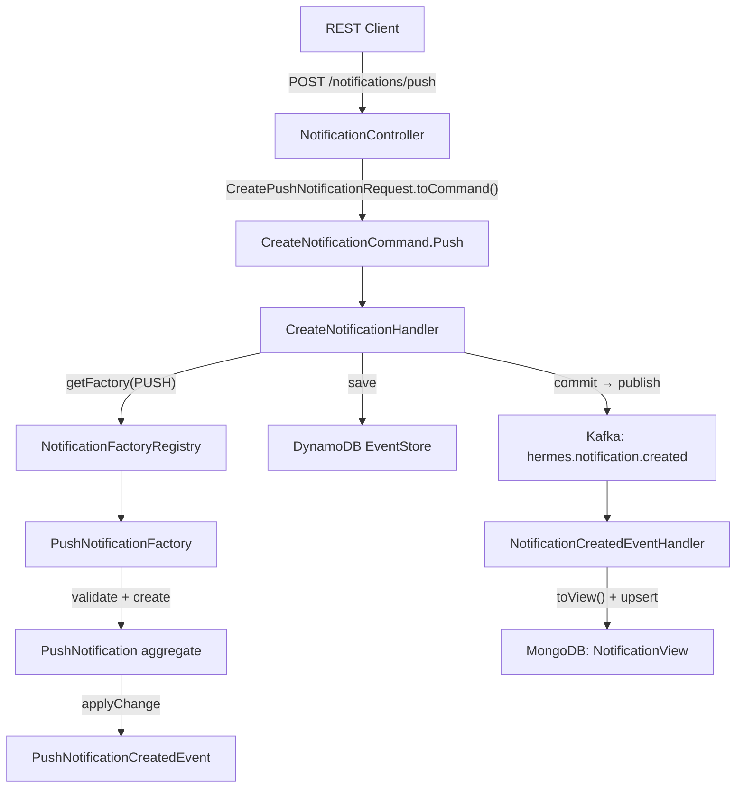

# Implementation Plan: Push Notification Channel

## Goal

Add a complete Push Notification channel to Hermes following the established aggregate pattern. This includes a new `PushNotification` entity, `PushNotificationFactory`, `PushNotificationCreatedEvent`, `DeviceToken` value object, CQRS command, REST request/response DTOs, REST endpoint, and projector update. All components follow the existing Hexagonal / DDD / Event Sourcing conventions.

## Requirements

- New `DeviceToken` value object (`@JvmInline value class`, non-blank, max 4096 chars)
- New `PushNotification` entity extending `Notification`
- New `PushNotificationCreatedEvent` added to the sealed `NotificationCreatedEvent` hierarchy
- New `PushNotificationFactory` implementing `NotificationFactory<PushNotification>`
- New `CreateNotificationInput.Push` variant
- New `CreateNotificationCommand.Push` variant with `toInput()` mapping
- Register `PushNotificationFactory` in `NotificationFactoryRegistry`
- New `CreatePushNotificationRequest` DTO
- New REST endpoint `POST /notifications/push` in `NotificationController`
- Update `NotificationResponse.from()` to handle `PushNotification`
- Update `NotificationView` with push-specific fields (`deviceToken`, `title`)
- Update `NotificationCreatedEventHandler.toView()` for `PushNotificationCreatedEvent`
- Update `KafkaEventWrapper` serialization/deserialization for push events
- New error types in `BaseError.kt` if needed (e.g., `InvalidDeviceTokenError`)

## Technical Considerations

### System Architecture Overview

### Technology Stack Selection

No new dependencies required. Uses existing Kotlin, Quarkus, Arrow-kt, DynamoDB, MongoDB, Kafka stack.

## Implementation Phases

### Phase 1: Domain Layer

#### 1.1 DeviceToken Value Object

- **File**: `src/main/kotlin/br/com/olympus/hermes/shared/domain/valueobjects/DeviceToken.kt`
- `@JvmInline value class DeviceToken private constructor(val value: String)`
- Companion factory `fun create(value: String): Either<InvalidDeviceTokenError, DeviceToken>`
- Validation: non-blank, max 4096 characters

#### 1.2 Error Type

- **File**: `src/main/kotlin/br/com/olympus/hermes/shared/domain/exceptions/BaseError.kt`
- Add `data class InvalidDeviceTokenError(val value: String) : ClientError` in the "Value Object Errors" section

#### 1.3 PushNotificationCreatedEvent

- **File**: `src/main/kotlin/br/com/olympus/hermes/shared/domain/events/DomainEvent.kt`
- Add `data class PushNotificationCreatedEvent` implementing `NotificationCreatedEvent`
- Fields: `aggregateId`, `content`, `payload`, `deviceToken: DeviceToken`, `title: String`, `data: Map<String, String>`

#### 1.4 PushNotification Entity

- **File**: `src/main/kotlin/br/com/olympus/hermes/shared/domain/entities/PushNotification.kt`
- Extends `Notification`, adds `deviceToken: DeviceToken`, `title: String`, `data: Map<String, String>`, `isNew: Boolean`
- `init` block raises `PushNotificationCreatedEvent` when `isNew`

#### 1.5 CreateNotificationInput.Push

- **File**: `src/main/kotlin/br/com/olympus/hermes/shared/domain/factories/CreateNotificationInput.kt`
- Add `data class Push(content, payload, deviceToken: String, title: String, data: Map<String, String>)`

#### 1.6 PushNotificationFactory

- **File**: `src/main/kotlin/br/com/olympus/hermes/shared/domain/factories/PushNotificationFactory.kt`
- Implements `NotificationFactory<PushNotification>`
- `create()`: validates via `zipOrAccumulate` — content non-blank, DeviceToken.create, title non-blank
- `reconstitute()`: finds `PushNotificationCreatedEvent`, rebuilds aggregate, replays history

#### 1.7 Register Factory

- **File**: `src/main/kotlin/br/com/olympus/hermes/shared/domain/factories/NotificationFactoryRegistry.kt`
- Add `register(NotificationType.PUSH, PushNotificationFactory())` in `init` block

### Phase 2: Application Layer

#### 2.1 CreateNotificationCommand.Push

- **File**: `src/main/kotlin/br/com/olympus/hermes/core/application/commands/CreateNotificationCommand.kt`
- Add `data class Push` variant with `deviceToken`, `title`, `data`
- Add `toInput()` mapping case for `Push`

### Phase 3: Infrastructure Layer

#### 3.1 KafkaEventWrapper — Push Serialization

- **File**: `src/main/kotlin/br/com/olympus/hermes/shared/infrastructure/messaging/KafkaEventWrapper.kt`
- Add `PushNotificationCreatedEvent` case in `toMap()` extension
- Add `toPushNotificationCreatedEvent()` deserialization helper on `Companion`
- Update `toNotificationCreatedEvent()` to handle the push event type

#### 3.2 NotificationView Update

- **File**: `src/main/kotlin/br/com/olympus/hermes/shared/infrastructure/readmodel/NotificationView.kt`
- Add `var deviceToken: String? = null` and `var title: String? = null` fields with `@BsonProperty`

#### 3.3 Projector Update

- **File**: `src/main/kotlin/br/com/olympus/hermes/core/application/eventhandlers/NotificationCreatedEventHandler.kt`
- Add `is PushNotificationCreatedEvent` branch in `toView()` that maps `deviceToken` and `title`

#### 3.4 REST Request DTO

- **File**: `src/main/kotlin/br/com/olympus/hermes/infrastructure/rest/request/CreatePushNotificationRequest.kt`
- Fields: `deviceToken`, `title`, `body` (maps to `content`), `payload`, `data`
- `toCommand()` method returns `CreateNotificationCommand.Push`

#### 3.5 REST Endpoint

- **File**: `src/main/kotlin/br/com/olympus/hermes/infrastructure/rest/controllers/NotificationController.kt`
- Add `@POST @Path("/push") fun createPushNotification(request: CreatePushNotificationRequest): Response`
- Same pattern as `createEmailNotification`

#### 3.6 NotificationResponse Update

- **File**: `src/main/kotlin/br/com/olympus/hermes/infrastructure/rest/response/NotificationResponse.kt`
- Add `is PushNotification -> NotificationType.PUSH` in the `when` expression

### Phase 4: Testing

#### 4.1 Unit Tests

- `DeviceTokenTest` — valid, blank, too-long tokens
- `PushNotificationFactoryTest` — create happy path, validation errors, reconstitution
- `PushNotificationTest` — event raised on creation

#### 4.2 Integration Tests

- `NotificationControllerPushTest` (`@QuarkusTest`) — POST /notifications/push returns 201; validation returns 400
- `NotificationCreatedEventHandlerPushTest` — push event projected correctly to `NotificationView`
