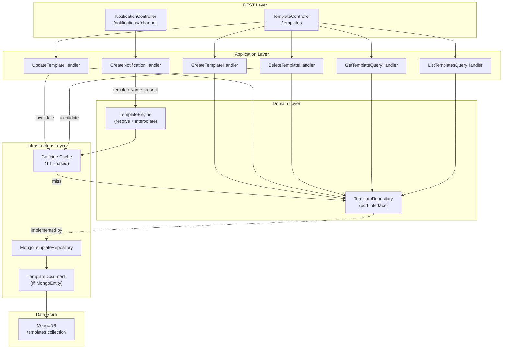

# Implementation Plan: Template Engine

## Goal

Introduce a Template Engine that stores named templates in MongoDB, caches them in-memory via Caffeine, and interpolates `{{variable}}` placeholders against a caller-supplied `payload` map. Provide CRUD REST endpoints under `/templates` and integrate template resolution into the existing `CreateNotificationHandler` flow. The engine is a pure domain service behind a repository port, preserving Hexagonal Architecture boundaries.

## Requirements

- `NotificationTemplate` domain entity (name, channel, subject, body, description, timestamps)
- `TemplateName` value object (slug validation)
- `TemplateBody` value object (non-blank, max 64 KB)
- `TemplateRepository` port interface in domain layer
- `TemplateEngine` domain service (resolve + interpolate)
- MongoDB `TemplateDocument` + Panache repository implementation
- Caffeine in-memory cache with configurable TTL
- CRUD REST endpoints (`POST`, `GET`, `PUT`, `DELETE`, list with pagination)
- Integration into `CreateNotificationHandler` (resolve template when `templateName` present)
- New error types: `TemplateNotFoundError`, `MissingTemplateVariablesError`, `TemplateDuplicateError`, `InvalidTemplateBodyError`, `InvalidTemplateNameError`
- Request/response DTOs for template endpoints
- OpenAPI annotations on all endpoints

## Technical Considerations

### System Architecture Overview

### Technology Stack

- **Caffeine**: In-memory cache (`io.quarkus:quarkus-cache` or direct `com.github.ben-manes.caffeine:caffeine` dependency)
- **Regex**: `\{\{(\w[\w.]*)\}\}` pattern for placeholder extraction
- All existing stack (Kotlin, Quarkus, Arrow-kt, MongoDB Panache, Jackson)

## Implementation Phases

### Phase 1: Domain Layer — Value Objects & Errors

#### 1.1 TemplateName Value Object

- **File**: `src/main/kotlin/br/com/olympus/hermes/shared/domain/valueobjects/TemplateName.kt`
- `@JvmInline value class TemplateName private constructor(val value: String)`
- Validation: non-blank, slug format (`^[a-z0-9]+(-[a-z0-9]+)*$`), max 128 chars
- Factory: `fun create(value: String): Either<InvalidTemplateNameError, TemplateName>`

#### 1.2 TemplateBody Value Object

- **File**: `src/main/kotlin/br/com/olympus/hermes/shared/domain/valueobjects/TemplateBody.kt`
- `@JvmInline value class TemplateBody private constructor(val value: String)`
- Validation: non-blank, max 65536 chars (64 KB)
- Factory: `fun create(value: String): Either<InvalidTemplateBodyError, TemplateBody>`

#### 1.3 Error Types

- **File**: `src/main/kotlin/br/com/olympus/hermes/shared/domain/exceptions/BaseError.kt`
- Add in "Value Object Errors" section:
  - `data class InvalidTemplateNameError(val value: String) : ClientError`
  - `data class InvalidTemplateBodyError(val reason: String) : ClientError`
- Add in new "Template Errors" section:
  - `data class TemplateNotFoundError(val name: String, val channel: String) : ClientError`
  - `data class TemplateDuplicateError(val name: String, val channel: String) : ClientError`
  - `data class MissingTemplateVariablesError(val missing: List<String>) : ClientError`

### Phase 2: Domain Layer — Entity, Port, Service

#### 2.1 NotificationTemplate Entity

- **File**: `src/main/kotlin/br/com/olympus/hermes/shared/domain/entities/NotificationTemplate.kt`
- Not an aggregate root (no event sourcing for templates — simple CRUD)
- Fields: `name: TemplateName`, `channel: NotificationType`, `subject: String?`, `body: TemplateBody`, `description: String?`, `createdAt: Date`, `updatedAt: Date`
- Pure domain entity — no infrastructure annotations

#### 2.2 TemplateRepository Port

- **File**: `src/main/kotlin/br/com/olympus/hermes/shared/domain/repositories/TemplateRepository.kt`
- Interface with methods:
  - `fun findByNameAndChannel(name: TemplateName, channel: NotificationType): Either<BaseError, NotificationTemplate?>`
  - `fun findAllByChannel(channel: NotificationType?, page: Int, size: Int): Either<BaseError, List<NotificationTemplate>>`
  - `fun save(template: NotificationTemplate): Either<BaseError, NotificationTemplate>`
  - `fun update(template: NotificationTemplate): Either<BaseError, NotificationTemplate>`
  - `fun deleteByNameAndChannel(name: TemplateName, channel: NotificationType): Either<BaseError, Boolean>`
  - `fun existsByNameAndChannel(name: TemplateName, channel: NotificationType): Either<BaseError, Boolean>`

#### 2.3 ResolvedTemplate

- **File**: `src/main/kotlin/br/com/olympus/hermes/shared/domain/entities/ResolvedTemplate.kt`
- `data class ResolvedTemplate(val body: String, val subject: String?)`

#### 2.4 TemplateEngine Domain Service

- **File**: `src/main/kotlin/br/com/olympus/hermes/shared/domain/services/TemplateEngine.kt`
- Constructor injection: `TemplateRepository`
- Method: `fun resolve(templateName: TemplateName, channel: NotificationType, payload: Map<String, Any>): Either<BaseError, ResolvedTemplate>`
  1. Look up template via repository (cache-aware at infra level)
  2. If not found → `TemplateNotFoundError`
  3. Extract placeholders from `body` (and `subject` if present) using regex `\{\{(\w[\w.]*)\}\}`
  4. Check all placeholders have corresponding keys in `payload`
  5. If missing → `MissingTemplateVariablesError`
  6. Replace all `{{var}}` with `payload[var].toString()`
  7. Return `ResolvedTemplate`

### Phase 3: Infrastructure Layer

#### 3.1 TemplateDocument (MongoDB)

- **File**: `src/main/kotlin/br/com/olympus/hermes/shared/infrastructure/readmodel/TemplateDocument.kt`
- `@MongoEntity(collection = "templates")` extending `PanacheMongoEntityBase`
- Fields: `name`, `channel`, `subject`, `body`, `description`, `createdAt`, `updatedAt`
- Composite unique index on `(name, channel)`
- `PanacheMongoCompanion` for static query methods

#### 3.2 MongoTemplateRepository

- **File**: `src/main/kotlin/br/com/olympus/hermes/shared/infrastructure/readmodel/MongoTemplateRepository.kt`
- `@ApplicationScoped` implementing `TemplateRepository`
- Maps between `NotificationTemplate` domain entity and `TemplateDocument`
- Wraps MongoDB operations in `Either.catch { ... }.mapLeft { PersistenceError(...) }`

#### 3.3 CachingTemplateRepository (Decorator)

- **File**: `src/main/kotlin/br/com/olympus/hermes/shared/infrastructure/readmodel/CachingTemplateRepository.kt`
- `@ApplicationScoped` decorator wrapping `MongoTemplateRepository`
- Uses Caffeine cache keyed by `"$name:$channel"`
- TTL configurable via `application.properties` (`hermes.template.cache-ttl-seconds=300`)
- `save`, `update`, `delete` invalidate corresponding cache entries
- CDI qualifier `@TemplateCache` to distinguish from raw Mongo repository

#### 3.4 Caffeine Dependency

- Add `com.github.ben-manes.caffeine:caffeine` to `pom.xml` (or `quarkus-cache` extension)

### Phase 4: Application Layer — CQRS Handlers

#### 4.1 CreateTemplateCommand + Handler

- **File**: `src/main/kotlin/br/com/olympus/hermes/core/application/commands/CreateTemplateCommand.kt`
- **File**: `src/main/kotlin/br/com/olympus/hermes/core/application/commands/CreateTemplateHandler.kt`
- Validates VO creation, checks `existsByNameAndChannel`, saves via repository
- Returns `Either<BaseError, NotificationTemplate>`

#### 4.2 UpdateTemplateCommand + Handler

- **File**: `src/main/kotlin/br/com/olympus/hermes/core/application/commands/UpdateTemplateCommand.kt`
- **File**: `src/main/kotlin/br/com/olympus/hermes/core/application/commands/UpdateTemplateHandler.kt`
- Validates VOs, fetches existing, updates fields, saves

#### 4.3 DeleteTemplateCommand + Handler

- **File**: `src/main/kotlin/br/com/olympus/hermes/core/application/commands/DeleteTemplateCommand.kt`
- **File**: `src/main/kotlin/br/com/olympus/hermes/core/application/commands/DeleteTemplateHandler.kt`
- Deletes by name + channel

#### 4.4 GetTemplateQuery + Handler

- **File**: `src/main/kotlin/br/com/olympus/hermes/core/application/queries/GetTemplateQuery.kt`
- **File**: `src/main/kotlin/br/com/olympus/hermes/core/application/queries/GetTemplateQueryHandler.kt`

#### 4.5 ListTemplatesQuery + Handler

- **File**: `src/main/kotlin/br/com/olympus/hermes/core/application/queries/ListTemplatesQuery.kt`
- **File**: `src/main/kotlin/br/com/olympus/hermes/core/application/queries/ListTemplatesQueryHandler.kt`

#### 4.6 Update CreateNotificationHandler

- **File**: `src/main/kotlin/br/com/olympus/hermes/core/application/commands/CreateNotificationHandler.kt`
- Inject `TemplateEngine`
- Before factory.create: if `command.templateName != null`, call `templateEngine.resolve(...)` and override `content` (and `subject` for Email) in the command's input
- If `templateName` is null, use raw `content` as-is

#### 4.7 Update CreateNotificationCommand

- **File**: `src/main/kotlin/br/com/olympus/hermes/core/application/commands/CreateNotificationCommand.kt`
- Add optional `templateName: String?` field to the sealed interface and all subtypes

### Phase 5: REST Layer

#### 5.1 Template Request/Response DTOs

- **File**: `src/main/kotlin/br/com/olympus/hermes/infrastructure/rest/request/CreateTemplateRequest.kt`
- **File**: `src/main/kotlin/br/com/olympus/hermes/infrastructure/rest/request/UpdateTemplateRequest.kt`
- **File**: `src/main/kotlin/br/com/olympus/hermes/infrastructure/rest/response/TemplateResponse.kt`

#### 5.2 TemplateController

- **File**: `src/main/kotlin/br/com/olympus/hermes/infrastructure/rest/controllers/TemplateController.kt`
- `@Path("/templates")`
- Endpoints: `POST`, `GET /{name}`, `GET` (list), `PUT /{name}`, `DELETE /{name}`
- All with `@QueryParam("channel")` where needed
- OpenAPI annotations

#### 5.3 Update Notification Request DTOs

- Add optional `templateName: String?` to `CreateEmailNotificationRequest` and future SMS/WhatsApp/Push DTOs
- Update `toCommand()` mappings

### Phase 6: Configuration

#### 6.1 application.properties

- `hermes.template.cache-ttl-seconds=300`
- `hermes.template.placeholder-regex=\\{\\{(\\w[\\w.]*)\\}\\}`

### Phase 7: Testing

#### 7.1 Unit Tests

- `TemplateNameTest` — valid slugs, invalid formats, length limits
- `TemplateBodyTest` — valid body, blank, exceeds max length
- `TemplateEngineTest` — resolve happy path, template not found, missing variables, no placeholders, subject interpolation for Email
- `CreateTemplateHandlerTest` — happy path, duplicate name+channel error
- `UpdateTemplateHandlerTest` — happy path, not found
- `DeleteTemplateHandlerTest` — happy path, not found

#### 7.2 Integration Tests

- `TemplateControllerIT` — CRUD endpoints (201, 200, 204, 404, 409)
- `CreateNotificationWithTemplateIT` — send notification with templateName, verify resolved content
- `CachingTemplateRepositoryIT` — cache hit vs miss, invalidation on update/delete
