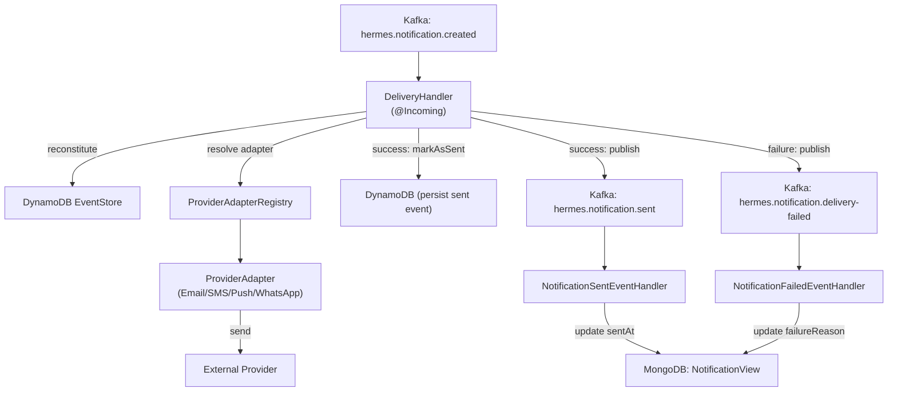

# Implementation Plan: Notification Delivery Pipeline

## Goal

Introduce an asynchronous delivery pipeline that consumes `NotificationCreatedEvent`s from Kafka, reconstitutes the aggregate from DynamoDB, invokes the appropriate channel provider adapter, and publishes lifecycle events (`NotificationSentEvent`, `NotificationDeliveryFailedEvent`) back through Kafka. Includes idempotency guards and configurable retry with exponential backoff.

## Requirements

- New `NotificationDeliveryFailedEvent` domain event
- `NotificationProviderAdapter<T>` output port interface
- `ProviderAdapterRegistry` (maps `NotificationType` → adapter)
- `DeliveryHandler` Kafka consumer (consumes `hermes.notification.created`, distinct channel from projector)
- Idempotency guard: skip delivery if aggregate already sent
- Publish `NotificationSentEvent` on success → `hermes.notification.sent`
- Publish `NotificationDeliveryFailedEvent` on failure → `hermes.notification.delivery-failed`
- New projectors: `NotificationSentEventHandler`, `NotificationFailedEventHandler`
- Update `NotificationView` with `failureReason` field
- Kafka channel/topic configuration
- Retry and timeout configuration in `application.properties`

## Technical Considerations

### System Architecture Overview



### Key Design Decisions

- **Separate Kafka consumer group**: `DeliveryHandler` uses a distinct `@Incoming` channel (`hermes-notification-delivery`) mapped to the same topic `hermes.notification.created` but with its own consumer group, so it runs independently from the projector.
- **Idempotency**: Reconstitute aggregate before delivery; if `sentAt != null`, skip.
- **Retry**: Rely on SmallRye Reactive Messaging's built-in retry + DLQ strategy. The handler throws `RuntimeException` on transient failures to trigger nack/retry.
- **Provider receipt**: The provider adapter returns `Either<BaseError, ProviderReceipt>` where `ProviderReceipt` is a data class holding the provider-specific receipt/ID.

## Implementation Phases

### Phase 1: Domain Layer

#### 1.1 ProviderReceipt

- **File**: `src/main/kotlin/br/com/olympus/hermes/shared/domain/valueobjects/ProviderReceipt.kt`
- `data class ProviderReceipt(val receiptId: String, val provider: String, val rawResponse: Map<String, Any> = emptyMap())`

#### 1.2 NotificationDeliveryFailedEvent

- **File**: `src/main/kotlin/br/com/olympus/hermes/shared/domain/events/DomainEvent.kt`
- Add `data class NotificationDeliveryFailedEvent(val aggregateId: String, val reason: String, val failedAt: Date = Date()) : DomainEvent`

#### 1.3 Update Notification Entity — apply()

- **File**: `src/main/kotlin/br/com/olympus/hermes/shared/domain/entities/Notification.kt`
- Add `is NotificationDeliveryFailedEvent -> { /* optionally track failure count */ }` in `apply()` when expression

#### 1.4 Error Types

- **File**: `src/main/kotlin/br/com/olympus/hermes/shared/domain/exceptions/BaseError.kt`
- Add `data class DeliveryError(val reason: String, override val cause: Throwable? = null) : ServerError` in "Infrastructure Errors" section
- Add `data class ProviderAdapterNotFoundError(val type: NotificationType) : ServerError`

### Phase 2: Application Layer — Ports

#### 2.1 NotificationProviderAdapter Port

- **File**: `src/main/kotlin/br/com/olympus/hermes/shared/application/ports/NotificationProviderAdapter.kt`
- Interface:
  ```
  interface NotificationProviderAdapter {
      fun send(notification: Notification): Either<BaseError, ProviderReceipt>
      fun supports(type: NotificationType): Boolean
  }
  ```

#### 2.2 ProviderAdapterRegistry

- **File**: `src/main/kotlin/br/com/olympus/hermes/shared/application/ports/ProviderAdapterRegistry.kt`
- `@ApplicationScoped` class
- `fun getAdapter(type: NotificationType): Either<BaseError, NotificationProviderAdapter>`
- Injected with all `NotificationProviderAdapter` beans via CDI `Instance<NotificationProviderAdapter>`

### Phase 3: Infrastructure Layer — Kafka

#### 3.1 KafkaEventWrapper Updates

- **File**: `src/main/kotlin/br/com/olympus/hermes/shared/infrastructure/messaging/KafkaEventWrapper.kt`
- Add serialization/deserialization for `NotificationSentEvent` and `NotificationDeliveryFailedEvent`
- `toNotificationSentEvent()` and `toNotificationDeliveryFailedEvent()` on `Companion`

#### 3.2 DeliveryHandler (Kafka Consumer)

- **File**: `src/main/kotlin/br/com/olympus/hermes/infrastructure/kafka/consumers/DeliveryHandler.kt`
- `@ApplicationScoped` class
- `@Incoming("hermes-notification-delivery") @Blocking fun consume(json: String)`
- Steps:
  1. Deserialize `KafkaEventWrapper` → `NotificationCreatedEvent`
  2. Extract `aggregateId` and `type` from event
  3. Reconstitute aggregate from `EventStore` via `NotificationFactoryRegistry`
  4. Idempotency check: if `sentAt != null`, log and return
  5. Resolve provider adapter via `ProviderAdapterRegistry`
  6. Call `adapter.send(notification)`
  7. On success: `aggregate.markAsSent(receipt)` → persist to EventStore → publish `NotificationSentEvent`
  8. On failure: publish `NotificationDeliveryFailedEvent` → throw `RuntimeException` for nack

#### 3.3 Kafka Channel Configuration

- **File**: `src/main/resources/application.properties`
- Add:
  ```
  # Delivery consumer (separate consumer group)
  mp.messaging.incoming.hermes-notification-delivery.connector=smallrye-kafka
  mp.messaging.incoming.hermes-notification-delivery.topic=hermes.notification.created
  mp.messaging.incoming.hermes-notification-delivery.group.id=hermes-delivery
  mp.messaging.incoming.hermes-notification-delivery.value.deserializer=org.apache.kafka.common.serialization.StringDeserializer
  mp.messaging.incoming.hermes-notification-delivery.auto.offset.reset=earliest
  mp.messaging.incoming.hermes-notification-delivery.failure-strategy=dead-letter-queue

  # Sent events
  mp.messaging.outgoing.hermes-notification-sent.connector=smallrye-kafka
  mp.messaging.outgoing.hermes-notification-sent.topic=hermes.notification.sent
  mp.messaging.outgoing.hermes-notification-sent.value.serializer=org.apache.kafka.common.serialization.StringSerializer

  # Failed events
  mp.messaging.outgoing.hermes-notification-failed.connector=smallrye-kafka
  mp.messaging.outgoing.hermes-notification-failed.topic=hermes.notification.delivery-failed
  mp.messaging.outgoing.hermes-notification-failed.value.serializer=org.apache.kafka.common.serialization.StringSerializer

  # Delivery config
  hermes.delivery.max-retries=3
  hermes.delivery.initial-backoff-ms=1000
  hermes.delivery.backoff-multiplier=2.0
  hermes.delivery.provider-timeout-ms=10000
  ```

### Phase 4: Projectors

#### 4.1 NotificationSentEventHandler

- **File**: `src/main/kotlin/br/com/olympus/hermes/core/application/eventhandlers/NotificationSentEventHandler.kt`
- `@Incoming("hermes-notification-sent-projector") @Blocking`
- Consumes `NotificationSentEvent`, updates `NotificationView.sentAt`

#### 4.2 NotificationFailedEventHandler

- **File**: `src/main/kotlin/br/com/olympus/hermes/core/application/eventhandlers/NotificationFailedEventHandler.kt`
- `@Incoming("hermes-notification-failed-projector") @Blocking`
- Consumes `NotificationDeliveryFailedEvent`, updates `NotificationView.failureReason`

#### 4.3 NotificationView Update

- **File**: `src/main/kotlin/br/com/olympus/hermes/shared/infrastructure/readmodel/NotificationView.kt`
- Add `var failureReason: String? = null` with `@BsonProperty`

#### 4.4 Kafka Channel Config for Projectors

- Add incoming channels `hermes-notification-sent-projector` and `hermes-notification-failed-projector` mapped to their respective topics with `failure-strategy=dead-letter-queue`

### Phase 5: Testing

#### 5.1 Unit Tests

- `DeliveryHandlerTest` — mock adapter, verify happy path, idempotency skip, failure propagation
- `ProviderAdapterRegistryTest` — resolve adapter by type, not found error

#### 5.2 Integration Tests

- `DeliveryHandlerIT` — end-to-end: create notification → Kafka → delivery → sent event → view updated
- `NotificationSentEventHandlerIT` — consume sent event, verify `sentAt` in view
- `NotificationFailedEventHandlerIT` — consume failed event, verify `failureReason` in view
