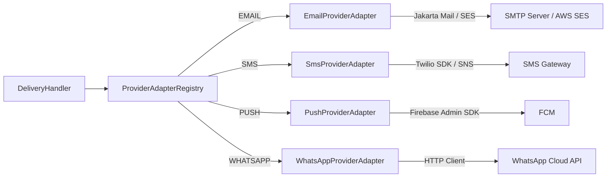

# Implementation Plan: Channel Provider Adapters

## Goal

Implement four channel-specific provider adapters behind the `NotificationProviderAdapter` output port interface. Each adapter translates a Hermes notification aggregate into an external API call (SMTP/SES, Twilio/SNS, FCM, WhatsApp Business API) and returns a `ProviderReceipt`. Adapters are pure infrastructure — no business logic — and are auto-discovered by the `ProviderAdapterRegistry` via CDI.

## Requirements

- `EmailProviderAdapter` — sends via SMTP (Jakarta Mail) or AWS SES
- `SmsProviderAdapter` — sends via Twilio or AWS SNS
- `PushProviderAdapter` — sends via Firebase Admin SDK (FCM)
- `WhatsAppProviderAdapter` — sends via WhatsApp Business Cloud API (HTTP)
- All adapters implement `NotificationProviderAdapter` port
- Provider credentials injected via `@ConfigProperty` / env vars
- Configurable timeout per provider
- Structured logging with correlation ID (aggregate ID)
- No business logic in adapters

## Technical Considerations

### System Architecture Overview



### Package Structure

```
shared/infrastructure/providers/
├── EmailProviderAdapter.kt
├── SmsProviderAdapter.kt
├── PushProviderAdapter.kt
└── WhatsAppProviderAdapter.kt
```

### Dependencies (pom.xml)

- `jakarta.mail:jakarta.mail-api` + `org.eclipse.angus:angus-mail` (SMTP) — or `software.amazon.awssdk:ses` (SES)
- `com.twilio.sdk:twilio` — or `software.amazon.awssdk:sns`
- `com.google.firebase:firebase-admin`
- Quarkus REST Client Reactive (`quarkus-rest-client-reactive-jackson`) for WhatsApp HTTP calls

## Implementation Phases

### Phase 1: Email Provider Adapter

#### 1.1 Configuration

- **File**: `src/main/resources/application.properties`
- Properties:
  ```
  hermes.provider.email.smtp-host=${EMAIL_SMTP_HOST:smtp.example.com}
  hermes.provider.email.smtp-port=${EMAIL_SMTP_PORT:587}
  hermes.provider.email.smtp-username=${EMAIL_SMTP_USERNAME:}
  hermes.provider.email.smtp-password=${EMAIL_SMTP_PASSWORD:}
  hermes.provider.email.smtp-starttls=${EMAIL_SMTP_STARTTLS:true}
  hermes.provider.email.timeout-ms=${EMAIL_TIMEOUT_MS:10000}
  ```

#### 1.2 EmailProviderAdapter

- **File**: `src/main/kotlin/br/com/olympus/hermes/shared/infrastructure/providers/EmailProviderAdapter.kt`
- `@ApplicationScoped` implementing `NotificationProviderAdapter`
- `supports(type) = type == NotificationType.EMAIL`
- `send(notification)`:
  1. Cast to `EmailNotification`
  2. Build `MimeMessage` with from, to, subject, content
  3. Send via `Transport.send()` within `Either.catch { ... }.mapLeft { DeliveryError(...) }`
  4. Return `ProviderReceipt(messageId, "smtp")`
- Inject config via `@ConfigProperty`

### Phase 2: SMS Provider Adapter

#### 2.1 Configuration

- Properties:
  ```
  hermes.provider.sms.account-sid=${SMS_ACCOUNT_SID:}
  hermes.provider.sms.auth-token=${SMS_AUTH_TOKEN:}
  hermes.provider.sms.from-number=${SMS_FROM_NUMBER:}
  hermes.provider.sms.timeout-ms=${SMS_TIMEOUT_MS:10000}
  ```

#### 2.2 SmsProviderAdapter

- **File**: `src/main/kotlin/br/com/olympus/hermes/shared/infrastructure/providers/SmsProviderAdapter.kt`
- `@ApplicationScoped` implementing `NotificationProviderAdapter`
- `supports(type) = type == NotificationType.SMS`
- `send(notification)`:
  1. Cast to `SmsNotification`
  2. Use Twilio SDK: `Message.creator(to, from, body).create()`
  3. Return `ProviderReceipt(message.sid, "twilio")`

### Phase 3: Push Provider Adapter

#### 3.1 Configuration

- Properties:
  ```
  hermes.provider.push.fcm-credentials-path=${FCM_CREDENTIALS_PATH:}
  hermes.provider.push.timeout-ms=${PUSH_TIMEOUT_MS:10000}
  ```

#### 3.2 PushProviderAdapter

- **File**: `src/main/kotlin/br/com/olympus/hermes/shared/infrastructure/providers/PushProviderAdapter.kt`
- `@ApplicationScoped` implementing `NotificationProviderAdapter`
- `supports(type) = type == NotificationType.PUSH`
- `send(notification)`:
  1. Cast to `PushNotification`
  2. Build FCM `Message` with `Notification(title, body)` and `Token(deviceToken)`
  3. Add `data` map as custom data
  4. `FirebaseMessaging.getInstance().send(message)`
  5. Return `ProviderReceipt(response, "fcm")`
- Initialise `FirebaseApp` in a `@PostConstruct` or CDI producer

### Phase 4: WhatsApp Provider Adapter

#### 4.1 Configuration

- Properties:
  ```
  hermes.provider.whatsapp.api-url=${WHATSAPP_API_URL:https://graph.facebook.com/v18.0}
  hermes.provider.whatsapp.access-token=${WHATSAPP_ACCESS_TOKEN:}
  hermes.provider.whatsapp.phone-number-id=${WHATSAPP_PHONE_NUMBER_ID:}
  hermes.provider.whatsapp.timeout-ms=${WHATSAPP_TIMEOUT_MS:10000}
  ```

#### 4.2 WhatsAppProviderAdapter

- **File**: `src/main/kotlin/br/com/olympus/hermes/shared/infrastructure/providers/WhatsAppProviderAdapter.kt`
- `@ApplicationScoped` implementing `NotificationProviderAdapter`
- `supports(type) = type == NotificationType.WHATSAPP`
- `send(notification)`:
  1. Cast to `WhatsAppNotification`
  2. Build HTTP POST to `{api-url}/{phone-number-id}/messages`
  3. Body: `{ messaging_product: "whatsapp", to: ..., type: "template", template: { name: ..., language: ..., components: [...] } }`
  4. Set `Authorization: Bearer {access-token}` header
  5. Parse response for message ID
  6. Return `ProviderReceipt(messageId, "whatsapp")`
- Use `java.net.http.HttpClient` with timeout

### Phase 5: Maven Dependencies

- **File**: `pom.xml`
- Add:
  - `org.eclipse.angus:angus-mail` (SMTP implementation)
  - `com.twilio.sdk:twilio`
  - `com.google.firebase:firebase-admin`
  - No extra dep for WhatsApp (use JDK HttpClient)

### Phase 6: Testing

#### 6.1 Unit Tests (MockK)

- `EmailProviderAdapterTest` — happy path with mocked Transport, failure handling, timeout
- `SmsProviderAdapterTest` — happy path with mocked Twilio, failure handling
- `PushProviderAdapterTest` — happy path with mocked FirebaseMessaging, failure handling
- `WhatsAppProviderAdapterTest` — happy path with mocked HttpClient, failure handling, timeout

#### 6.2 Integration Tests

- `EmailProviderAdapterIT` — send to a test SMTP server (GreenMail or similar)
- `SmsProviderAdapterIT` — send to Twilio test credentials (test number)
- `PushProviderAdapterIT` — send to FCM with test project (or mock server)
- `WhatsAppProviderAdapterIT` — send to WhatsApp sandbox or mock HTTP server

#### 6.3 Contract Tests

- Verify each adapter returns `ProviderReceipt` with non-blank `receiptId` and correct `provider` name
- Verify each adapter returns `DeliveryError` on provider failure
- Verify `supports()` returns true only for the correct `NotificationType`
