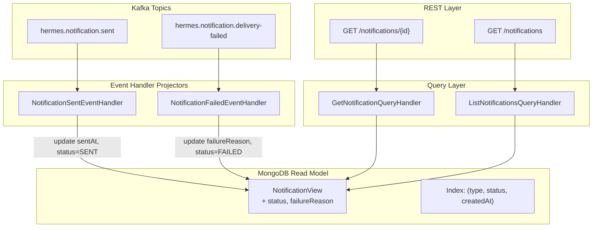

# Implementation Plan: Delivery Lifecycle Tracking

## Goal

Extend the read model and query API to provide full delivery lifecycle tracking. Add `status` and `failureReason` fields to `NotificationView`, create projectors for sent/failed events, enhance the existing GET endpoint, and introduce a new list endpoint with pagination and filtering.

## Requirements

- Update `NotificationView` with `status` and `failureReason` fields
- `NotificationSentEventHandler` projector (updates `sentAt`, `status = SENT`)
- `NotificationFailedEventHandler` projector (updates `failureReason`, `status = FAILED`)
- Update `NotificationCreatedEventHandler` to set initial `status = PENDING`
- New `ListNotificationsQuery` + `ListNotificationsQueryHandler`
- New paginated response DTO (`PaginatedNotificationResponse`)
- New `GET /notifications` endpoint with query params: `page`, `size`, `type`, `status`, `createdFrom`, `createdTo`
- Update `GET /notifications/{id}` response to include lifecycle fields
- MongoDB compound index on `(type, status, createdAt)`
- Update `NotificationViewRepository` port with query methods

## Technical Considerations

### System Architecture Overview



## Implementation Phases

### Phase 1: Read Model Updates

#### 1.1 NotificationView — New Fields

- **File**: `src/main/kotlin/br/com/olympus/hermes/shared/infrastructure/readmodel/NotificationView.kt`
- Add:
  - `@BsonProperty("status") var status: String = "PENDING"`
  - `@BsonProperty("failureReason") var failureReason: String? = null`

#### 1.2 NotificationCreatedEventHandler — Set Initial Status

- **File**: `src/main/kotlin/br/com/olympus/hermes/core/application/eventhandlers/NotificationCreatedEventHandler.kt`
- In `toView()`, set `view.status = "PENDING"`

#### 1.3 MongoDB Index

- Create compound index programmatically or via a startup initialiser:
  - Index: `{ type: 1, status: 1, createdAt: -1 }`
- **File**: `src/main/kotlin/br/com/olympus/hermes/shared/config/MongoIndexInitializer.kt` (new)
- `@ApplicationScoped` class with `@PostConstruct` or Quarkus startup event to ensure index exists

### Phase 2: Projectors

#### 2.1 NotificationSentEventHandler

- **File**: `src/main/kotlin/br/com/olympus/hermes/core/application/eventhandlers/NotificationSentEventHandler.kt`
- `@ApplicationScoped` implementing `EventHandler<NotificationSentEvent>`
- `handle(event)`: update `NotificationView` by aggregate ID — set `sentAt = event.sentAt`, `status = "SENT"`, `updatedAt = now`
- `@Incoming("hermes-notification-sent-projector") @Blocking fun consume(json: String)`
- Deserialise `KafkaEventWrapper`, extract `NotificationSentEvent`, call `handle()`
- Idempotent: if `sentAt` already set with same value, no-op

#### 2.2 NotificationFailedEventHandler

- **File**: `src/main/kotlin/br/com/olympus/hermes/core/application/eventhandlers/NotificationFailedEventHandler.kt`
- `@ApplicationScoped` implementing `EventHandler<NotificationDeliveryFailedEvent>`
- `handle(event)`: update `NotificationView` by aggregate ID — set `failureReason = event.reason`, `status = "FAILED"`, `updatedAt = now`
- `@Incoming("hermes-notification-failed-projector") @Blocking fun consume(json: String)`
- Idempotent

#### 2.3 Kafka Channel Configuration

- **File**: `src/main/resources/application.properties`
- Add:
  ```
  mp.messaging.incoming.hermes-notification-sent-projector.connector=smallrye-kafka
  mp.messaging.incoming.hermes-notification-sent-projector.topic=hermes.notification.sent
  mp.messaging.incoming.hermes-notification-sent-projector.group.id=hermes-sent-projector
  mp.messaging.incoming.hermes-notification-sent-projector.value.deserializer=org.apache.kafka.common.serialization.StringDeserializer
  mp.messaging.incoming.hermes-notification-sent-projector.auto.offset.reset=earliest
  mp.messaging.incoming.hermes-notification-sent-projector.failure-strategy=dead-letter-queue

  mp.messaging.incoming.hermes-notification-failed-projector.connector=smallrye-kafka
  mp.messaging.incoming.hermes-notification-failed-projector.topic=hermes.notification.delivery-failed
  mp.messaging.incoming.hermes-notification-failed-projector.group.id=hermes-failed-projector
  mp.messaging.incoming.hermes-notification-failed-projector.value.deserializer=org.apache.kafka.common.serialization.StringDeserializer
  mp.messaging.incoming.hermes-notification-failed-projector.auto.offset.reset=earliest
  mp.messaging.incoming.hermes-notification-failed-projector.failure-strategy=dead-letter-queue
  ```

### Phase 3: Repository Updates

#### 3.1 NotificationViewRepository Port — New Methods

- **File**: `src/main/kotlin/br/com/olympus/hermes/shared/domain/repositories/NotificationViewRepository.kt`
- Add:
  - `fun updateStatus(id: String, status: String, sentAt: Date?, failureReason: String?): Either<BaseError, Unit>`
  - `fun findAll(type: String?, status: String?, createdFrom: Date?, createdTo: Date?, page: Int, size: Int): Either<BaseError, PaginatedResult<NotificationView>>`
  - `fun countAll(type: String?, status: String?, createdFrom: Date?, createdTo: Date?): Either<BaseError, Long>`

#### 3.2 PaginatedResult

- **File**: `src/main/kotlin/br/com/olympus/hermes/shared/domain/repositories/PaginatedResult.kt`
- `data class PaginatedResult<T>(val content: List<T>, val page: Int, val size: Int, val totalElements: Long, val totalPages: Int)`

#### 3.3 MongoNotificationViewRepository — Implement New Methods

- **File**: `src/main/kotlin/br/com/olympus/hermes/shared/infrastructure/readmodel/MongoNotificationViewRepository.kt`
- Implement `updateStatus` using Panache `update()` with partial document update
- Implement `findAll` using Panache `find()` with dynamic BSON query built from filter params + pagination
- Implement `countAll` with matching filter

### Phase 4: Application Layer — Queries

#### 4.1 ListNotificationsQuery

- **File**: `src/main/kotlin/br/com/olympus/hermes/core/application/queries/ListNotificationsQuery.kt`
- `data class ListNotificationsQuery(val type: String?, val status: String?, val createdFrom: Date?, val createdTo: Date?, val page: Int, val size: Int) : Query<PaginatedResult<NotificationView>>`

#### 4.2 ListNotificationsQueryHandler

- **File**: `src/main/kotlin/br/com/olympus/hermes/core/application/queries/ListNotificationsQueryHandler.kt`
- `@ApplicationScoped` implementing `QueryHandler<ListNotificationsQuery, PaginatedResult<NotificationView>>`
- Delegates to `NotificationViewRepository.findAll(...)`

### Phase 5: REST Layer

#### 5.1 PaginatedNotificationResponse

- **File**: `src/main/kotlin/br/com/olympus/hermes/infrastructure/rest/response/PaginatedNotificationResponse.kt`
- `data class PaginatedNotificationResponse(val content: List<NotificationViewResponse>, val page: Int, val size: Int, val totalElements: Long, val totalPages: Int)`

#### 5.2 NotificationViewResponse

- **File**: `src/main/kotlin/br/com/olympus/hermes/infrastructure/rest/response/NotificationViewResponse.kt`
- Full DTO mapping from `NotificationView` — includes `id`, `type`, `content`, `from`, `to`, `status`, `sentAt`, `deliveryAt`, `seenAt`, `failureReason`, `createdAt`, `updatedAt`

#### 5.3 NotificationController — List Endpoint

- **File**: `src/main/kotlin/br/com/olympus/hermes/infrastructure/rest/controllers/NotificationController.kt`
- Add `@GET fun listNotifications(@QueryParam type, @QueryParam status, @QueryParam createdFrom, @QueryParam createdTo, @QueryParam page, @QueryParam size): Response`
- Add or update `@GET @Path("/{id}") fun getNotification(@PathParam id): Response` to return `NotificationViewResponse`
- OpenAPI annotations

### Phase 6: Testing

#### 6.1 Unit Tests

- `ListNotificationsQueryHandlerTest` — delegates to repository, handles empty results, respects filters
- `NotificationSentEventHandlerTest` — updates view correctly, idempotent
- `NotificationFailedEventHandlerTest` — updates view correctly, idempotent

#### 6.2 Integration Tests

- `NotificationControllerListIT` — pagination, type filter, status filter, date range filter, combined filters
- `NotificationSentEventHandlerIT` — consume Kafka event → verify view update
- `NotificationFailedEventHandlerIT` — consume Kafka event → verify view update
- `MongoNotificationViewRepositoryIT` — verify index exists, query performance with filters
