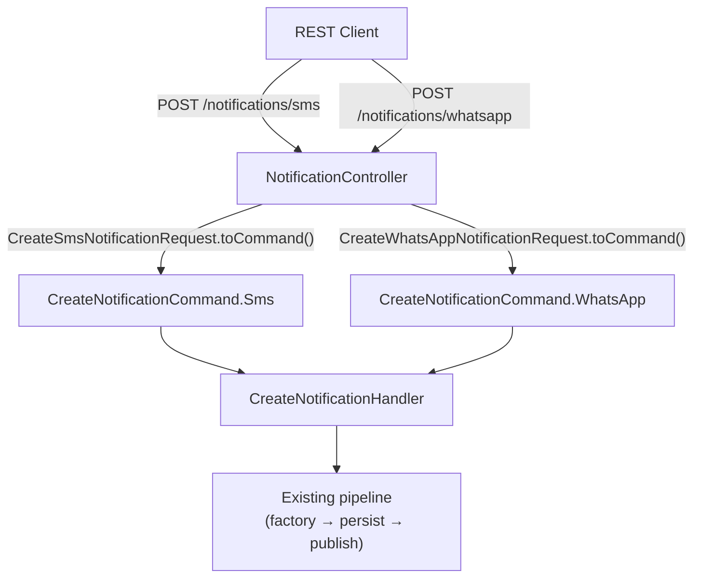

# Implementation Plan: SMS & WhatsApp REST Endpoints

## Goal

Add REST endpoints `POST /notifications/sms` and `POST /notifications/whatsapp` with their corresponding request DTOs. This is a thin REST layer addition — no domain or application layer changes required. Both endpoints delegate to the existing `CreateNotificationHandler` via the already-implemented `CreateNotificationCommand.Sms` and `CreateNotificationCommand.WhatsApp` subtypes.

## Requirements

- `CreateSmsNotificationRequest` DTO with `toCommand()` method
- `CreateWhatsAppNotificationRequest` DTO with `toCommand()` method
- Two new endpoint methods in `NotificationController`
- SmallRye OpenAPI annotations on both endpoints
- Optional `templateName` field in both DTOs for future Template Engine integration

## Technical Considerations

### System Architecture Overview



### Package Structure

```
infrastructure/rest/
├── controllers/
│   └── NotificationController.kt  (update — add 2 methods)
├── request/
│   ├── CreateEmailNotificationRequest.kt  (existing)
│   ├── CreateSmsNotificationRequest.kt    (new)
│   └── CreateWhatsAppNotificationRequest.kt (new)
└── response/
    └── NotificationResponse.kt  (existing, no changes)
```

## Implementation Phases

### Phase 1: Request DTOs

#### 1.1 CreateSmsNotificationRequest

- **File**: `src/main/kotlin/br/com/olympus/hermes/infrastructure/rest/request/CreateSmsNotificationRequest.kt`
- Fields: `content: String`, `payload: Map<String, Any> = emptyMap()`, `from: UInt`, `to: String`, `templateName: String? = null`
- `fun toCommand(): CreateNotificationCommand.Sms` mapping all fields

#### 1.2 CreateWhatsAppNotificationRequest

- **File**: `src/main/kotlin/br/com/olympus/hermes/infrastructure/rest/request/CreateWhatsAppNotificationRequest.kt`
- Fields: `content: String`, `payload: Map<String, Any> = emptyMap()`, `from: String`, `to: String`, `templateName: String`, `notificationTemplateName: String? = null`
  - Note: `templateName` here is the WhatsApp Business API template name (required by WhatsApp). `notificationTemplateName` is the optional Hermes template name for content resolution (F2).
- `fun toCommand(): CreateNotificationCommand.WhatsApp` mapping all fields

### Phase 2: Controller Endpoints

#### 2.1 NotificationController — SMS Endpoint

- **File**: `src/main/kotlin/br/com/olympus/hermes/infrastructure/rest/controllers/NotificationController.kt`
- Add method:
  ```
  @POST
  @Path("/sms")
  fun createSmsNotification(request: CreateSmsNotificationRequest): Response
  ```
- Same pattern as `createEmailNotification`: call `createNotificationHandler.handle(request.toCommand())`, fold Left/Right to Response

#### 2.2 NotificationController — WhatsApp Endpoint

- Same file, add method:
  ```
  @POST
  @Path("/whatsapp")
  fun createWhatsAppNotification(request: CreateWhatsAppNotificationRequest): Response
  ```
- Same pattern

### Phase 3: OpenAPI Annotations

- Add `@Operation`, `@APIResponse`, `@RequestBody` annotations on both new methods
- Add `@Schema` annotations on both request DTOs

### Phase 4: Testing

#### 4.1 Unit Tests

- `CreateSmsNotificationRequestTest` — `toCommand()` maps all fields correctly
- `CreateWhatsAppNotificationRequestTest` — `toCommand()` maps all fields correctly

#### 4.2 Integration Tests (`@QuarkusTest`)

- `NotificationControllerSmsIT`:
  - `POST /notifications/sms with valid request returns 201`
  - `POST /notifications/sms with invalid phone returns 400`
  - `POST /notifications/sms with blank content returns 400`
  - `POST /notifications/sms with multiple errors returns 400 with accumulated errors`
- `NotificationControllerWhatsAppIT`:
  - `POST /notifications/whatsapp with valid request returns 201`
  - `POST /notifications/whatsapp with invalid phone returns 400`
  - `POST /notifications/whatsapp with blank templateName returns 400`
  - `POST /notifications/whatsapp with blank content returns 400`
  - `POST /notifications/whatsapp with multiple errors returns 400 with accumulated errors`
