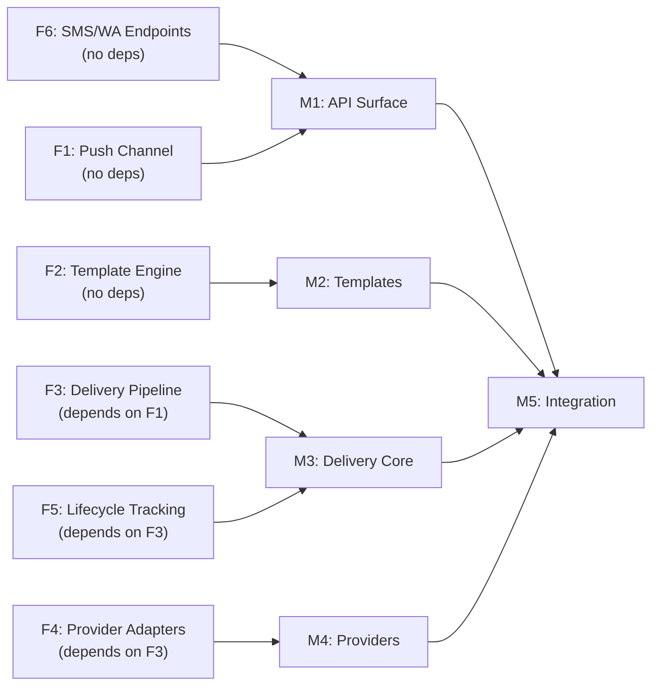

# Project Plan: Multi-Channel Notification Delivery with Template Engine

## 1. Project Overview

### Feature Summary

Transform Hermes from a notification recording service into a full notification delivery platform by adding: Push Notification channel, a dynamic Template Engine, an asynchronous Delivery Pipeline, four channel Provider Adapters (Email SMTP, SMS Twilio, Push FCM, WhatsApp Business API), delivery lifecycle tracking with query enhancements, and missing SMS/WhatsApp REST endpoints.

### Success Criteria

| KPI | Target |
|-----|--------|
| Delivery Success Rate | ≥ 99 % of accepted notifications delivered within 60 s |
| Template Resolution Latency | < 50 ms p99 (< 5 ms cache hit) |
| API Availability | ≥ 99.9 % uptime |
| DLQ Depth | < 100 messages at steady state |
| Duplicate Delivery Rate | 0 % |
| Test Coverage | ≥ 80 % line coverage on new code |

### Key Milestones

| Milestone | Features | T-Shirt Size |
|-----------|----------|-------------|
| **M1: API Surface Complete** | F1 (Push Channel) + F6 (SMS/WhatsApp Endpoints) | M |
| **M2: Template Engine** | F2 (Template Engine) | M |
| **M3: Delivery Pipeline Core** | F3 (Delivery Pipeline) + F5 (Lifecycle Tracking) | L |
| **M4: Provider Adapters** | F4 (Channel Provider Adapters) | L |
| **M5: Integration & Hardening** | End-to-end testing, performance tuning, docs | S |

### Risk Assessment

| Risk | Likelihood | Impact | Mitigation |
|------|-----------|--------|------------|
| External provider SDK breaking changes | Low | Medium | Pin dependency versions; contract tests |
| Kafka consumer group rebalance causes duplicate delivery | Medium | High | Idempotency guard on aggregate `sentAt` |
| Template cache stale data | Medium | Medium | TTL + explicit invalidation on write |
| DynamoDB throttling under load | Low | High | On-demand capacity mode; retry with backoff |
| Scope creep (rich media, i18n, batch) | Medium | Medium | Strict out-of-scope enforcement |

## 2. Work Item Hierarchy

```mermaid
graph TD
    EPIC["Epic: Multi-Channel Notification Delivery<br/>with Template Engine"]

    EPIC --> F1["F1: Push Notification Channel<br/>(M — 8 SP)"]
    EPIC --> F2["F2: Template Engine<br/>(M — 13 SP)"]
    EPIC --> F3["F3: Delivery Pipeline<br/>(L — 13 SP)"]
    EPIC --> F4["F4: Channel Provider Adapters<br/>(L — 13 SP)"]
    EPIC --> F5["F5: Delivery Lifecycle Tracking<br/>(M — 10 SP)"]
    EPIC --> F6["F6: SMS & WhatsApp REST Endpoints<br/>(S — 5 SP)"]

    F1 --> F1S1["Story: Send push via API"]
    F1 --> F1E1["Enabler: DeviceToken VO"]
    F1 --> F1E2["Enabler: PushNotification aggregate"]
    F1 --> F1T1["Test: Push channel tests"]

    F2 --> F2S1["Story: CRUD templates"]
    F2 --> F2S2["Story: Templated notification"]
    F2 --> F2E1["Enabler: TemplateEngine service"]
    F2 --> F2E2["Enabler: Caffeine cache"]
    F2 --> F2T1["Test: Template engine tests"]

    F3 --> F3S1["Story: Auto-delivery"]
    F3 --> F3E1["Enabler: ProviderAdapter port"]
    F3 --> F3E2["Enabler: DeliveryHandler consumer"]
    F3 --> F3T1["Test: Delivery pipeline tests"]

    F4 --> F4S1["Story: Email adapter"]
    F4 --> F4S2["Story: SMS adapter"]
    F4 --> F4S3["Story: Push adapter"]
    F4 --> F4S4["Story: WhatsApp adapter"]
    F4 --> F4T1["Test: Provider adapter tests"]

    F5 --> F5S1["Story: Query lifecycle status"]
    F5 --> F5S2["Story: List with filtering"]
    F5 --> F5E1["Enabler: Sent/Failed projectors"]
    F5 --> F5T1["Test: Lifecycle tracking tests"]

    F6 --> F6S1["Story: SMS endpoint"]
    F6 --> F6S2["Story: WhatsApp endpoint"]
    F6 --> F6T1["Test: Endpoint tests"]
```



## 3. Dependency Graph



### Dependency Types

| Feature | Blocked By | Blocks | Can Parallel With |
|---------|-----------|--------|-------------------|
| **F1** Push Channel | — | F3 (uses Push aggregate) | F2, F6 |
| **F2** Template Engine | — | — (integration is additive) | F1, F6 |
| **F3** Delivery Pipeline | F1 (Push aggregate needed) | F4, F5 | F2 |
| **F4** Provider Adapters | F3 (port interface defined there) | — | F5 |
| **F5** Lifecycle Tracking | F3 (sent/failed events defined there) | — | F4 |
| **F6** SMS/WA Endpoints | — | — | F1, F2 |

## 4. GitHub Issues Breakdown

### Epic Issue

```markdown
# Epic: Multi-Channel Notification Delivery with Template Engine

## Description
Transform Hermes from a notification recording service into a full delivery platform.
Four channels (Email, SMS, Push, WhatsApp), dynamic template engine, async delivery pipeline.

## Features
- [ ] F1: Push Notification Channel
- [ ] F2: Template Engine
- [ ] F3: Notification Delivery Pipeline
- [ ] F4: Channel Provider Adapters
- [ ] F5: Delivery Lifecycle Tracking
- [ ] F6: SMS & WhatsApp REST Endpoints

## Definition of Done
- [ ] All four channels can create and deliver notifications via REST API
- [ ] Template engine resolves named templates with variable interpolation
- [ ] Delivery pipeline auto-delivers and tracks lifecycle (sent/failed)
- [ ] ≥ 80 % test coverage on new code
- [ ] OpenAPI docs complete for all endpoints
- [ ] Integration tests pass for all channels

Labels: `epic`, `priority-critical`, `value-high`
Estimate: L (62 SP total)
```

### Feature Issues

#### F1: Push Notification Channel (8 SP)

| # | Type | Title | SP | Priority | Depends On |
|---|------|-------|-----|----------|-----------|
| F1-E1 | Enabler | Create `DeviceToken` value object + `InvalidDeviceTokenError` | 1 | P0 | — |
| F1-E2 | Enabler | Create `PushNotificationCreatedEvent` domain event | 1 | P0 | — |
| F1-E3 | Enabler | Create `PushNotification` entity + `PushNotificationFactory` | 2 | P0 | F1-E1, F1-E2 |
| F1-S1 | Story | Add `CreateNotificationCommand.Push` + `CreateNotificationInput.Push` | 1 | P1 | F1-E3 |
| F1-S2 | Story | Add `POST /notifications/push` endpoint + request DTO | 1 | P1 | F1-S1 |
| F1-S3 | Story | Update projector, `KafkaEventWrapper`, `NotificationView` for Push | 1 | P1 | F1-E2 |
| F1-T1 | Test | Unit + integration tests for Push channel | 1 | P1 | F1-S2, F1-S3 |

#### F2: Template Engine (13 SP)

| # | Type | Title | SP | Priority | Depends On |
|---|------|-------|-----|----------|-----------|
| F2-E1 | Enabler | Create `TemplateName`, `TemplateBody` VOs + error types | 1 | P0 | — |
| F2-E2 | Enabler | Create `NotificationTemplate` entity + `TemplateRepository` port | 1 | P0 | F2-E1 |
| F2-E3 | Enabler | Implement `MongoTemplateRepository` + `TemplateDocument` | 2 | P0 | F2-E2 |
| F2-E4 | Enabler | Implement `CachingTemplateRepository` (Caffeine) | 2 | P1 | F2-E3 |
| F2-E5 | Enabler | Implement `TemplateEngine` domain service (resolve + interpolate) | 2 | P0 | F2-E2 |
| F2-S1 | Story | CRUD command/query handlers for templates | 2 | P1 | F2-E3, F2-E5 |
| F2-S2 | Story | `TemplateController` REST endpoints (CRUD) | 1 | P1 | F2-S1 |
| F2-S3 | Story | Integrate template resolution into `CreateNotificationHandler` | 1 | P1 | F2-E5 |
| F2-T1 | Test | Unit + integration tests for Template Engine | 1 | P1 | F2-S2, F2-S3 |

#### F3: Notification Delivery Pipeline (13 SP)

| # | Type | Title | SP | Priority | Depends On |
|---|------|-------|-----|----------|-----------|
| F3-E1 | Enabler | Create `ProviderReceipt`, `NotificationDeliveryFailedEvent`, error types | 1 | P0 | — |
| F3-E2 | Enabler | Create `NotificationProviderAdapter` port + `ProviderAdapterRegistry` | 2 | P0 | F3-E1 |
| F3-E3 | Enabler | Update `KafkaEventWrapper` for sent/failed event serde | 1 | P0 | F3-E1 |
| F3-E4 | Enabler | Configure new Kafka topics/channels (delivery, sent, failed) | 1 | P0 | — |
| F3-S1 | Story | Implement `DeliveryHandler` Kafka consumer (routing, idempotency) | 3 | P0 | F3-E2, F3-E3, F3-E4, F1 |
| F3-S2 | Story | Implement `NotificationSentEventHandler` projector | 2 | P1 | F3-E3, F3-E4 |
| F3-S3 | Story | Implement `NotificationFailedEventHandler` projector | 2 | P1 | F3-E3, F3-E4 |
| F3-T1 | Test | Unit + integration tests for Delivery Pipeline | 1 | P1 | F3-S1, F3-S2, F3-S3 |

#### F4: Channel Provider Adapters (13 SP)

| # | Type | Title | SP | Priority | Depends On |
|---|------|-------|-----|----------|-----------|
| F4-E1 | Enabler | Add Maven dependencies (Jakarta Mail, Twilio, Firebase Admin) | 1 | P0 | — |
| F4-S1 | Story | Implement `EmailProviderAdapter` (SMTP) | 3 | P1 | F3-E2, F4-E1 |
| F4-S2 | Story | Implement `SmsProviderAdapter` (Twilio) | 3 | P1 | F3-E2, F4-E1 |
| F4-S3 | Story | Implement `PushProviderAdapter` (FCM) | 3 | P1 | F3-E2, F4-E1, F1 |
| F4-S4 | Story | Implement `WhatsAppProviderAdapter` (Business API) | 2 | P1 | F3-E2, F4-E1 |
| F4-T1 | Test | Unit + integration tests for all provider adapters | 1 | P1 | F4-S1–S4 |

#### F5: Delivery Lifecycle Tracking (10 SP)

| # | Type | Title | SP | Priority | Depends On |
|---|------|-------|-----|----------|-----------|
| F5-E1 | Enabler | Add `status`, `failureReason` to `NotificationView` + MongoDB index | 1 | P0 | — |
| F5-E2 | Enabler | Create `PaginatedResult` + update `NotificationViewRepository` port | 1 | P0 | F5-E1 |
| F5-E3 | Enabler | Implement `MongoNotificationViewRepository` query methods | 2 | P1 | F5-E2 |
| F5-S1 | Story | `ListNotificationsQuery` + handler (pagination, filtering) | 2 | P1 | F5-E3 |
| F5-S2 | Story | `GET /notifications` list endpoint + response DTOs | 2 | P1 | F5-S1 |
| F5-S3 | Story | Enhance `GET /notifications/{id}` with full lifecycle response | 1 | P1 | F5-E1 |
| F5-T1 | Test | Unit + integration tests for lifecycle tracking | 1 | P1 | F5-S2, F5-S3 |

#### F6: SMS & WhatsApp REST Endpoints (5 SP)

| # | Type | Title | SP | Priority | Depends On |
|---|------|-------|-----|----------|-----------|
| F6-S1 | Story | `CreateSmsNotificationRequest` + `POST /notifications/sms` | 2 | P1 | — |
| F6-S2 | Story | `CreateWhatsAppNotificationRequest` + `POST /notifications/whatsapp` | 2 | P1 | — |
| F6-T1 | Test | Unit + integration tests for SMS/WhatsApp endpoints | 1 | P1 | F6-S1, F6-S2 |

## 5. Priority and Value Matrix

| Issue | Priority | Value | Rationale |
|-------|----------|-------|-----------|
| F6 SMS/WA Endpoints | P1 | High | Quick win; unblocks existing channels |
| F1 Push Channel | P1 | High | Completes channel matrix; blocks F3 |
| F2 Template Engine | P1 | High | Core differentiator; decouples content |
| F3 Delivery Pipeline | P0 | Critical | Core delivery capability; blocks F4, F5 |
| F4 Provider Adapters | P1 | High | Enables actual delivery |
| F5 Lifecycle Tracking | P1 | Medium | Observability; needed for production |

## 6. Suggested Sprint Plan

### Sprint 1 — API Surface + Template Foundation

**Goal**: Complete REST API surface for all channels; begin Template Engine domain layer.

| Feature | Issues | SP |
|---------|--------|-----|
| F6 | F6-S1, F6-S2, F6-T1 | 5 |
| F1 | F1-E1, F1-E2, F1-E3, F1-S1 | 5 |
| F2 | F2-E1, F2-E2 | 2 |
| **Total** | | **12** |

### Sprint 2 — Push Complete + Template Engine

**Goal**: Finish Push channel; complete Template Engine with cache and REST endpoints.

| Feature | Issues | SP |
|---------|--------|-----|
| F1 | F1-S2, F1-S3, F1-T1 | 3 |
| F2 | F2-E3, F2-E4, F2-E5, F2-S1, F2-S2 | 9 |
| **Total** | | **12** |

### Sprint 3 — Template Integration + Delivery Pipeline Core

**Goal**: Integrate templates into notification creation; build delivery pipeline core.

| Feature | Issues | SP |
|---------|--------|-----|
| F2 | F2-S3, F2-T1 | 2 |
| F3 | F3-E1, F3-E2, F3-E3, F3-E4, F3-S1 | 8 |
| **Total** | | **10** |

### Sprint 4 — Delivery Projectors + Provider Adapters Start

**Goal**: Complete delivery pipeline projectors; begin provider adapter implementations.

| Feature | Issues | SP |
|---------|--------|-----|
| F3 | F3-S2, F3-S3, F3-T1 | 5 |
| F4 | F4-E1, F4-S1 | 4 |
| F5 | F5-E1, F5-E2 | 2 |
| **Total** | | **11** |

### Sprint 5 — Provider Adapters + Lifecycle Tracking

**Goal**: Complete all provider adapters; implement lifecycle query enhancements.

| Feature | Issues | SP |
|---------|--------|-----|
| F4 | F4-S2, F4-S3, F4-S4 | 8 |
| F5 | F5-E3, F5-S1 | 4 |
| **Total** | | **12** |

### Sprint 6 — Lifecycle REST + Integration Testing

**Goal**: Complete lifecycle REST endpoints; full end-to-end testing and hardening.

| Feature | Issues | SP |
|---------|--------|-----|
| F5 | F5-S2, F5-S3, F5-T1 | 4 |
| F4 | F4-T1 | 1 |
| Integration | End-to-end tests, performance tuning, docs | 5 |
| **Total** | | **10** |

### Summary

| Sprint | SP | Cumulative |
|--------|-----|-----------|
| Sprint 1 | 12 | 12 |
| Sprint 2 | 12 | 24 |
| Sprint 3 | 10 | 34 |
| Sprint 4 | 11 | 45 |
| Sprint 5 | 12 | 57 |
| Sprint 6 | 10 | 67 |

**Total**: ~62 SP across 6 sprints (12 weeks for a team of 2–3 developers).

## 7. Definition of Done (Global)

- [ ] All acceptance criteria met
- [ ] Code review approved
- [ ] Unit tests written and passing (≥ 80 % coverage)
- [ ] Integration tests passing
- [ ] No critical/high severity defects
- [ ] OpenAPI documentation updated
- [ ] KDoc on all public interfaces and classes
- [ ] No new Kotlin warnings
- [ ] `./mvnw verify` passes
