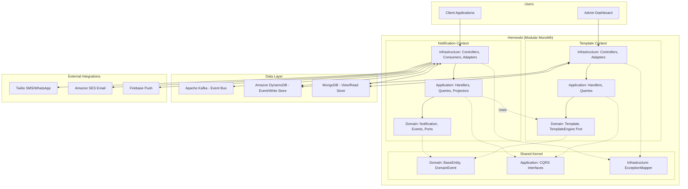

# Epic Architecture Specification

## 1. Epic Architecture Overview
This epic describes the architectural transformation of Hermeskt from a Layered Architecture to a Modular Monolith. The system will be reorganized into distinct, highly cohesive Bounded Contexts representing business domains (`notification`, `template`, and `shared`). Each bounded context will internally encapsulate its own Hexagonal Architecture layers (Domain, Application, Infrastructure). This guarantees strict boundaries while remaining a single deployable unit.

## 2. System Architecture Diagram

## 3. High-Level Features & Technical Enablers

**High-Level Features:**
Since this is a refactoring epic, there are no new functional features for the end-user. The primary deliverables substitute for features.

1. **Top-Level Context Packages**: Creation of `notification`, `template`, and `shared` top-level packages.
2. **Template Context Migration**: Moving all Template-bound entities, value objects, use cases, CQRS handlers, controllers, and database adapters into the `template` context.
3. **Notification Context Migration**: Moving all Notification-bound entities, value objects, ports, CQRS handlers, projectors, controllers, Kafka consumers, and DB adapters into the `notification` context.
4. **Shared Kernel Extraction**: Consolidating core building blocks (e.g., `BaseEntity`, `DomainEvent`, `DomainExceptionMapper`, `EventWrapper`) strictly within the `shared` module.
5. **Supplier-Customer Port Definition**: Modifying the integration between `notification` and `template` contexts so that it cleanly crosses context boundaries via an explicit interface or dependency injection without hard-coupling internal implementations.

**Technical Enablers:**
- None required physically. Relying purely on Kotlin language visibility modifiers, package structure, and CDI standard features.

## 4. Technology Stack
- **Language**: Kotlin 2.2 (JVM 21)
- **Framework**: Quarkus 3.30 (REST Jackson, SmallRye OpenAPI)
- **Architecture**: Modular Monolith, Domain-Driven Design (DDD), CQRS, Event Sourcing, Hexagonal Architecture
- **Write Store**: Amazon DynamoDB (Enhanced Client)
- **Read Store**: MongoDB (Quarkus MongoDB with Panache)
- **Messaging**: Apache Kafka (SmallRye Reactive Messaging)
- **Functional Error Handling**: Arrow-kt

## 5. Technical Value
**High**. This sets the foundation for a codebase that scales gracefully with team size and domain complexity. It actively prevents "Big Ball of Mud" anti-patterns and ensures that changes to the `template` rendering engine do not unexpectedly break the `notification` dispatch mechanism.

## 6. T-Shirt Size Estimate
**M (Medium)**. The codebase is currently small to mid-sized. The challenge lies in carefully tracing dependencies during package moves and ensuring Quarkus CDI/Reflection configurations resolve the new package paths properly during test and build execution.
