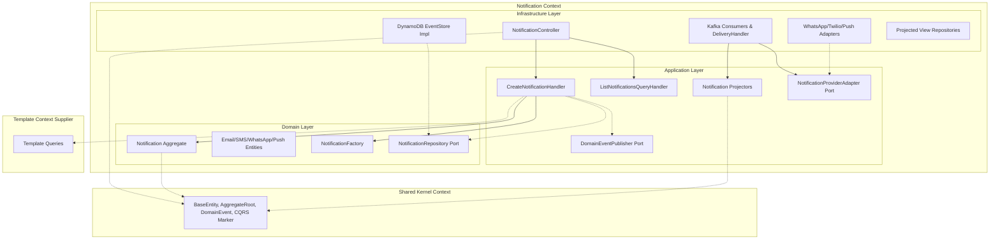

# Implementation Plan: Notification Context Migration

## Goal
The goal of this feature is to relocate all core Notification Management code—including multi-channel entities, provider adapters, Kafka consumers, and CQRS handlers—into a new unified `br.com.olympus.hermes.notification` package. This aligns the rest of the application with the Modular Monolith structure and encapsulates the core value stream.

## Requirements
- Create the structural `notification` package and internal Hexagonal Architecture boundaries (`domain`, `application`, `infrastructure`).
- Relocate Notification domains (`Notification`, `PushNotification`, `EmailNotification`, etc.).
- Relocate Notification value objects (`DeviceToken`, `BrazilianPhone`, `EmailSubject`), factories, and errors.
- Relocate Notification application logic (Projectors, Command Handlers, Query Handlers, and `DomainEventPublisher` interfaces).
- Relocate infrastructure logic: REST Controllers, DynamoDB mappings (`EventStore`), Kafka Consumers (`NotificationCreatedConsumer`), and external provider clients (`SES`, `Twilio`, etc.).
- Update all internal package imports.
- Delete empty legacy directories (`core`, etc.).

## Technical Considerations

### System Architecture Overview


- **Integration Points**: The Notification context relies on `TemplateEngine` / `TemplateRepository` (from the Template context) to hydrate message bodies before sending them to external providers.
- **Deployment Architecture**: Runs inside the same Quarkus JVM process alongside Template and Shared modules.

### Database Schema Design
N/A - The DynamoDB Single-Table pattern and underlying data structure remain completely unchanged. The `@DynamoDbBean` and `@MongoEntity` classes are simply moved.

### API Design
- The existing `/api/v1/notifications` endpoints defined in `NotificationController` remain fully compatible. 
- Input payload structs (`CreateEmailNotificationRequest`, etc.) merely change package location.

### Package Architecture
```
br.com.olympus.hermes.notification
├── domain
│   ├── entities
│   │   ├── Notification.kt
│   │   ├── EmailNotification.kt
│   │   └── ...
│   ├── factories
│   │   ├── NotificationFactory.kt
│   │   └── NotificationFactoryRegistry.kt
│   ├── repositories
│   │   ├── EventStore.kt
│   │   ├── NotificationRepository.kt
│   │   └── NotificationViewRepository.kt
│   └── valueobjects
│       ├── DeviceToken.kt
│       ├── BrazilianPhone.kt
│       └── ...
├── application
│   ├── commands
│   │   ├── CreateNotificationCommand.kt
│   │   └── CreateNotificationHandler.kt
│   ├── projectors
│   │   ├── NotificationCreatedProjector.kt
│   │   └── ...
│   ├── ports
│   │   ├── DomainEventPublisher.kt
│   │   └── NotificationProviderAdapter.kt
│   └── queries
│       ├── GetNotificationQuery.kt
│       └── ...
└── infrastructure
    ├── rest
    │   ├── controllers
    │   │   └── NotificationController.kt
    │   └── request/response DTOs...
    ├── messaging
    │   ├── KafkaDomainEventPublisher.kt
    │   └── consumers
    │       ├── NotificationCreatedConsumer.kt
    │       └── ...
    ├── persistence
    │   ├── DynamoDbEventStore.kt
    │   └── NotificationRecord.kt
    └── providers
        ├── SESProviderAdapter.kt
        └── TwilioProviderAdapter.kt
```

## Security & Performance
- **Data Validation**: JAX-RS rules remain active on controller inputs.
- **Performance**: Zero runtime overhead from moving packages. Better organization makes Dead-Code elimination and GraalVM native image compilation analysis potentially clearer to trace.
- **Resilience**: The Kafka consumer logic with Dead Letter Queues (DLQ) stays completely intact. Message routing (`mp.messaging.*` configuration) is unaffected because it relies on channel names, not package structures.
