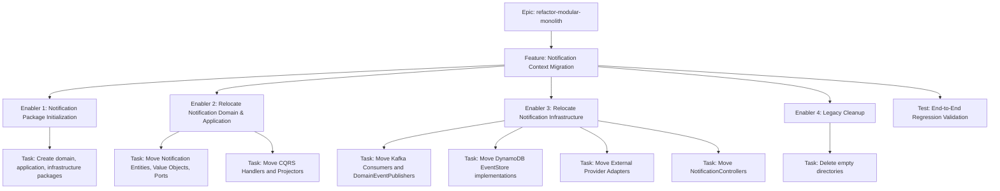
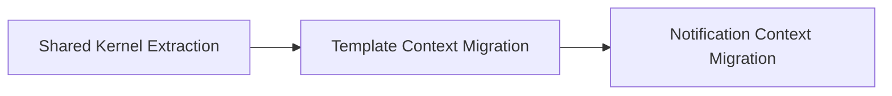

# Project Plan: Notification Context Migration

## 1. Project Overview
- **Feature Summary**: Moving the central Notification domain logic, Kafka infrastructure, external provider adapters, and core controllers into the newly strictly defined `br.com.olympus.hermes.notification` Bounded Context, completing the Modular Monolith transition.
- **Success Criteria**: 
  - `mvnw clean verify` completes successfully with 100% existing tests passing. 
  - All legacy directories (`core`, default non-context `infrastructure` and `shared`) are empty and deleted.
- **Key Milestones**: 
  1. Creation of package structure `notification/{domain, application, infrastructure}`.
  2. Relocation of Domain & Application Notification code.
  3. Relocation of Infrastructure Notification code (Kafka, DynamoDB, MongoDB, REST, Providers).
  4. Cleanup of legacy directories and global validation.
- **Risk Assessment**: High risk of breaking Kafka `@Incoming` consumers and `@DynamoDbBean` bindings. Mitigation: Tests using Kafka and Dynamo testcontainers must run clean.

## 2. Work Item Hierarchy


## 3. GitHub Issues Breakdown

### Feature Issue Template

```markdown
# Feature: Notification Context Migration

## Feature Description
Relocating all notification core logic into `br.com.olympus.hermes.notification` and completing the Modular Monolith structure.

## Technical Enablers
- [ ] #TODO - Notification Package Initialization
- [ ] #TODO - Relocate Notification Domain & Application
- [ ] #TODO - Relocate Notification Infrastructure
- [ ] #TODO - Legacy Package Clean-up

## Dependencies
**Blocked by**: Shared Kernel Extraction, Template Context Migration

## Acceptance Criteria
- [ ] The `notification` package exists and is the only domain interacting with external providers.
- [ ] Legacy root packages like `core` are deleted.
- [ ] Project compiles successfully and tests pass.

## Definition of Done
- [ ] Technical enablers completed
- [ ] Integration testing passed

## Labels
`feature`, `priority-critical`, `value-high`, `architecture`

## Epic
#TODO (refactor-modular-monolith)

## Estimate
M
```

### Technical Enabler: Relocate Notification Domain & Application

```markdown
# Technical Enabler: Relocate Notification Domain & Application

## Enabler Description
Moving `Notification` Aggregates, multi-channel entities, Factories, Value Objects, Projectors, and CQRS Handlers to the new `notification` domain and application packages.

## Technical Requirements
- [ ] Move `Notification`, `EmailNotification`, `SmsNotification` etc.
- [ ] Move `NotificationProviderAdapter` and `NotificationFactory` registries.
- [ ] Move `CreateNotificationHandler`, `ListNotificationsQueryHandler`, and Projectors.

## Implementation Tasks
- [ ] #TODO - Execute Git MV operations.
- [ ] #TODO - Update internal and test imports.

## Acceptance Criteria
- [ ] Files correctly relocated to `notification/domain` and `notification/application`.

## Definition of Done
- [ ] Implementation completed
- [ ] Unit tests passing

## Labels
`enabler`, `priority-critical`, `architecture`

## Estimate
3
```

### Technical Enabler: Relocate Notification Infrastructure

```markdown
# Technical Enabler: Relocate Notification Infrastructure

## Enabler Description
The most critical technical leap: Moving Kafka consumers/producers, DynamoDB `@DynamoDbBean` tables, Mongo read models, external providers, and REST controllers.

## Technical Requirements
- [ ] Move Kafka components (`NotificationCreatedConsumer`, `DeliveryHandler`, etc.).
- [ ] Move AWS DynamoDB EventStore implementation.
- [ ] Move external API clients (Twilio, SES).
- [ ] Move `NotificationController`.

## Implementation Tasks
- [ ] #TODO - Execute Git MV operations into `<root>/notification/infrastructure`.

## Acceptance Criteria
- [ ] System still connects to simulated providers and testcontainers successfully.

## Definition of Done
- [ ] Implementation completed
- [ ] Integration tests passing

## Labels
`enabler`, `priority-critical`, `infrastructure`

## Estimate
5
```

## 4. Priority and Value Matrix
| Priority | Value  | Criteria | Labels |
|---|---|---|---|
| P0 | High | Critical path, concludes the monolithic refactor | `priority-critical`, `value-high` |

## 5. Estimation Guidelines
- **Feature**: M (Medium - ~10 points total)
- **Enabler 2**: 3 points
- **Enabler 3**: 5 points

## 6. Dependency Management


## 7. Sprint Planning Template
**Sprint Goal**: Finalize the Modular Monolith by isolating the Notification domain and removing legacy directories.

## 8. GitHub Project Board Configuration
- **Custom Fields**: Priority (P0), Value (High), Component (Architecture), Epic (refactor-modular-monolith)
