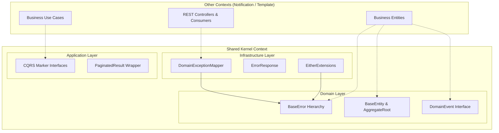

# Implementation Plan: Shared Kernel Extraction

## Goal
The goal of this feature is to extract all generic, domain-agnostic foundation code into a strictly isolated `shared` package (acting as the Shared Kernel Bounded Context) out of the existing interwoven layers. This establishes the structural cornerstone upon which the rest of the Modular Monolith refactor will be built.

## Requirements
- Create the explicit `shared` package structure conforming to Hexagonal Architecture (`domain`, `application`, `infrastructure`).
- Relocate generic domain models (`BaseEntity`, `DomainEvent`, `BaseError`, `EventWrapper`).
- Relocate generic application models (`Command`, `Query`, `CommandHandler`, `QueryHandler`, `EventHandler`, `PaginatedResult`).
- Relocate generic infrastructure code (`DomainExceptionMapper`, `ErrorResponse`, `EitherExtensions`).
- Ensure 0 coupling to business entities (e.g., `Notification` or `Template`).

## Technical Considerations

### System Architecture Overview


- **Integration Points**: The Shared Kernel exposes interfaces and base classes. All other contexts implicitly depend on it. The Shared Kernel itself has *no dependencies* on any other context.
- **Deployment Architecture**: Forms part of the standard Quarkus JVM/Native application.

### Database Schema Design
N/A - The shared kernel does not define distinct data tables. It provides base abstractions for repositories.

### API Design
N/A - The shared kernel does not expose business endpoints. It provides the global `DomainExceptionMapper` handling all `BaseError` translations into standard HTTP `ErrorResponse` payloads.

### Package Architecture
```
br.com.olympus.hermes.shared
├── domain
│   ├── entities
│   │   ├── BaseEntity.kt
│   │   └── AggregateRoot.kt
│   ├── events
│   │   ├── DomainEvent.kt
│   │   └── EventWrapper.kt
│   ├── exceptions
│   │   └── BaseError.kt
│   └── valueobjects
│       └── EntityId.kt
├── application
│   ├── cqrs
│   │   ├── Command.kt
│   │   ├── CommandHandler.kt
│   │   ├── Query.kt
│   │   ├── QueryHandler.kt
│   │   └── EventHandler.kt
│   └── repositories
│       └── PaginatedResult.kt
└── infrastructure
    └── rest
        ├── exceptions
        │   ├── DomainException.kt
        │   └── DomainExceptionMapper.kt
        ├── extensions
        │   └── EitherExtensions.kt
        └── response
            └── ErrorResponse.kt
```

## Security & Performance
- **Data Validation**: Centralized exception mapping ensures consistent HTTP 400/500 generation across the entire API surface without data leakage.
- **Performance**: Relocating these classes is a compile-time structural change, yielding zero runtime performance overhead compared to current state.
