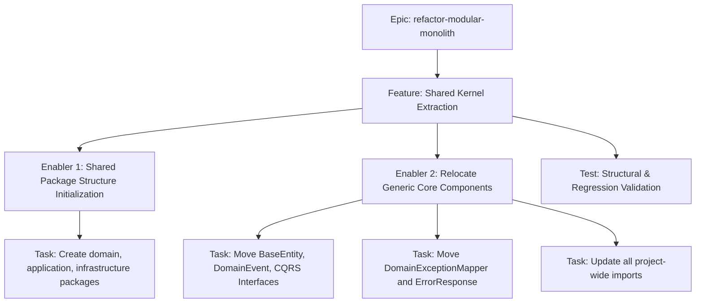

# Project Plan: Shared Kernel Extraction

## 1. Project Overview
- **Feature Summary**: Extracting domain-agnostic interfaces, base classes, and global exception mappers from interwoven layers into a dedicated `br.com.olympus.hermes.shared` Bounded Context.
- **Success Criteria**: `mvnw clean verify` completes successfully with 100% existing tests passing. No business dependencies exist inside `shared`.
- **Key Milestones**: 
  1. Creation of package structure.
  2. Relocation of generic Domain/Application/Infrastructure code.
  3. Global import update and compilation check.
- **Risk Assessment**: High risk of breaking reflection (CDI/Panache) if `DomainExceptionMapper` or similar classes lose their index. Mitigation: Rely strictly on Quarkus test boot logs.

## 2. Work Item Hierarchy


## 3. GitHub Issues Breakdown

### Epic Issue Template
*(See main Epic tracking board)*

### Feature Issue Template

```markdown
# Feature: Shared Kernel Extraction

## Feature Description
Extracting domain-agnostic interfaces, base classes, and global exception mappers into `br.com.olympus.hermes.shared`.

## User Stories in this Feature
*(N/A - Technical Refactoring)*

## Technical Enablers
- [ ] #TODO - Shared Package Structure Initialization
- [ ] #TODO - Relocate Generic Core Components

## Dependencies
**Blocks**: Template Context Migration, Notification Context Migration

## Acceptance Criteria
- [ ] The `shared` package exists and contains no Notification/Template imports.
- [ ] Project compiles successfully.

## Definition of Done
- [ ] Technical enablers completed
- [ ] Integration testing passed

## Labels
`feature`, `priority-critical`, `value-high`, `architecture`

## Epic
#TODO (refactor-modular-monolith)

## Estimate
S
```

### Technical Enabler: Relocate Generic Core Components

```markdown
# Technical Enabler: Relocate Generic Core Components

## Enabler Description
Moving files like `AggregateRoot`, CQRS interfaces, and `DomainExceptionMapper` to the new `shared` package.

## Technical Requirements
- [ ] Move `BaseEntity`, `AggregateRoot`, `DomainEvent`, `EventWrapper`, `BaseError`.
- [ ] Move `Command`, `Query`, `CommandHandler`, `EventHandler`, `PaginatedResult`.
- [ ] Move `DomainExceptionMapper`, `EitherExtensions`, `ErrorResponse`.

## Implementation Tasks
- [ ] #TODO - Execute Git MV operations.
- [ ] #TODO - Run global search/replace for `br.com.olympus.hermes.core...` to `br.com.olympus.hermes.shared...`

## Acceptance Criteria
- [ ] All files successfully relocated without compilation errors.
- [ ] Existing REST responses still correctly map `BaseError` to HTTP 400/500 via the mapper.

## Definition of Done
- [ ] Implementation completed
- [ ] Integration tests passing

## Labels
`enabler`, `priority-critical`, `infrastructure`

## Estimate
3
```

## 4. Priority and Value Matrix
| Priority | Value  | Criteria | Labels |
|---|---|---|---|
| P0 | High | Critical path, blocks all other context refactoring | `priority-critical`, `value-high` |

## 5. Estimation Guidelines
- **Feature**: S (Small - ~3-5 points total)
- **Enabler**: 3 points

## 6. Dependency Management


## 7. Sprint Planning Template
**Sprint Goal**: Establish the Shared Kernel to unblock remaining Modular Monolith refactoring.

## 8. GitHub Project Board Configuration
- **Custom Fields**: Priority (P0), Value (High), Component (Architecture), Epic (refactor-modular-monolith)
