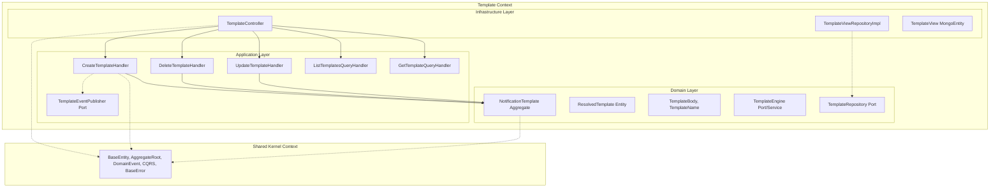

# Implementation Plan: Template Context Migration

## Goal
The goal of this feature is to extract all Template Management code into a standalone `br.com.olympus.hermes.template` package. This aligns the codebase with the Modular Monolith principles by grouping Domain, Application, and Infrastructure layers tightly around the business concept of Templates, separate from Notifications.

## Requirements
- Create the structural `template` package and internal Hexagonal Architecture boundaries (`domain`, `application`, `infrastructure`).
- Relocate Template domain models (`NotificationTemplate`, `ResolvedTemplate`, value objects, factories, domain events if any, and repository ports).
- Relocate Template CQRS logic and projectors from `core/application` to `template/application`.
- Relocate Template REST controllers and MongoDB Panache implementations from `infrastructure` to `template/infrastructure`.
- Update all internal package imports.
- Validate that the `template` context operates entirely independently of the `notification` context, interacting only with the generic `shared` context.

## Technical Considerations

### System Architecture Overview


- **Integration Points**: The `notification` context relies on `TemplateEngine` from the `template` context.
- **Deployment Architecture**: Forms part of the standard Quarkus JVM/Native application.

### Database Schema Design
N/A - The `TemplateView` MongoDB collection remains functionally identical, standardizing only its package location in the source code.

### API Design
- The existing `/api/v1/templates` endpoints defined in `TemplateController` remain fully compatible.
- Request/Response formats are identical.

### Package Architecture
```
br.com.olympus.hermes.template
├── domain
│   ├── entities
│   │   ├── NotificationTemplate.kt
│   │   └── ResolvedTemplate.kt
│   ├── repositories
│   │   └── TemplateRepository.kt
│   ├── services
│   │   └── TemplateEngine.kt
│   └── valueobjects
│       ├── TemplateBody.kt
│       └── TemplateName.kt
├── application
│   ├── commands
│   │   ├── CreateTemplateCommand.kt
│   │   ├── CreateTemplateHandler.kt
│   │   ├── DeleteTemplateCommand.kt
│   │   ├── DeleteTemplateHandler.kt
│   │   ├── UpdateTemplateCommand.kt
│   │   └── UpdateTemplateHandler.kt
│   └── queries
│       ├── GetTemplateQuery.kt
│       ├── GetTemplateQueryHandler.kt
│       ├── ListTemplatesQuery.kt
│       └── ListTemplatesQueryHandler.kt
└── infrastructure
    ├── rest
    │   ├── controllers
    │   │   └── TemplateController.kt
    │   ├── request
    │   │   ├── CreateTemplateRequest.kt
    │   │   └── UpdateTemplateRequest.kt
    │   └── response
    │       └── TemplateResponse.kt
    └── readmodel
        ├── TemplateView.kt
        └── TemplateViewRepositoryImpl.kt
```

## Security & Performance
- **Validation**: JAX-RS validation rules stay active on the `TemplateController` input DTOs.
- **Performance**: Relocation of files bears zero runtime cost. Compile-time dependency isolation improves developer efficiency.
