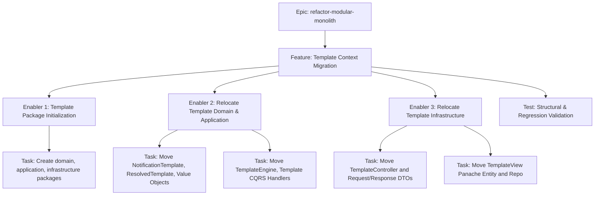
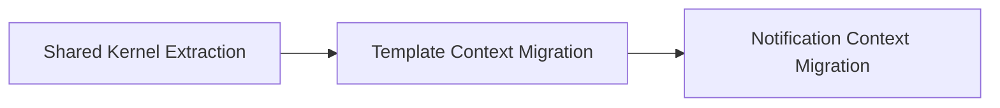

# Project Plan: Template Context Migration

## 1. Project Overview
- **Feature Summary**: Relocating all template-specific code (Domain Models, Services, REST Controllers, Use Cases, DB adapters) into a highly cohesive `br.com.olympus.hermes.template` context package.
- **Success Criteria**: `mvnw clean verify` completes successfully with 100% existing tests passing. No Notification-specific code resides inside the `template` package.
- **Key Milestones**: 
  1. Creation of package structure `template/{domain, application, infrastructure}`.
  2. Relocation of Domain & Application Template code.
  3. Relocation of Infrastructure Template code (REST & MongoDB).
  4. Global import update and test validation.
- **Risk Assessment**: Moderate risk of breaking Panache MongoDB entity scanning or REST endpoint reflection if annotations paths are strictly checked. Mitigation: Rely strictly on Quarkus test boot logs and existing functional tests.

## 2. Work Item Hierarchy


## 3. GitHub Issues Breakdown

### Feature Issue Template

```markdown
# Feature: Template Context Migration

## Feature Description
Relocating all template-specific code into `br.com.olympus.hermes.template`.

## User Stories in this Feature
*(N/A - Technical Refactoring)*

## Technical Enablers
- [ ] #TODO - Template Package Initialization
- [ ] #TODO - Relocate Template Domain & Application
- [ ] #TODO - Relocate Template Infrastructure

## Dependencies
**Blocked by**: Shared Kernel Extraction
**Blocks**: Notification Context Migration

## Acceptance Criteria
- [ ] The `template` package exists and contains no Notification imports.
- [ ] Project compiles successfully.
- [ ] All Template endpoints respond identically.

## Definition of Done
- [ ] Technical enablers completed
- [ ] Integration testing passed

## Labels
`feature`, `priority-high`, `value-medium`, `architecture`

## Epic
#TODO (refactor-modular-monolith)

## Estimate
S
```

### Technical Enabler: Relocate Template Domain & Application

```markdown
# Technical Enabler: Relocate Template Domain & Application

## Enabler Description
Moving `NotificationTemplate` Aggregate, `TemplateEngine`, Value Objects, and CQRS Handlers to the new `template` domain and application packages.

## Technical Requirements
- [ ] Move `NotificationTemplate`, `ResolvedTemplate`, `TemplateBody`, `TemplateName`.
- [ ] Move `TemplateEngine` and `TemplateRepository` (Ports).
- [ ] Move `Create/Update/DeleteTemplateHandler` and `Get/ListTemplateQueryHandler`.

## Implementation Tasks
- [ ] #TODO - Execute Git MV operations into `<root>/template/domain` and `<root>/template/application`.
- [ ] #TODO - Update project-wide imports.

## Acceptance Criteria
- [ ] All files successfully relocated without compilation errors.
- [ ] Notification context successfully imports `TemplateEngine` from its new package.

## Definition of Done
- [ ] Implementation completed
- [ ] Unit tests passing

## Labels
`enabler`, `priority-high`, `architecture`

## Estimate
2
```

### Technical Enabler: Relocate Template Infrastructure

```markdown
# Technical Enabler: Relocate Template Infrastructure

## Enabler Description
Moving REST endpoints (`TemplateController`) and MongoDB Panache models (`TemplateView`, `TemplateViewRepositoryImpl`) to the new infrastructure package.

## Technical Requirements
- [ ] Move `TemplateController`, `*TemplateRequest`, `TemplateResponse`.
- [ ] Move `TemplateView` Panache entity and related Mongo repository adapter.

## Implementation Tasks
- [ ] #TODO - Execute Git MV operations into `<root>/template/infrastructure`.
- [ ] #TODO - Verify MongoDB indexes are applied correctly on Quarkus boot.

## Acceptance Criteria
- [ ] API Endpoints remain at `/api/v1/templates` and unchanged.
- [ ] Mongo documents correctly load/save.

## Definition of Done
- [ ] Implementation completed
- [ ] Integration tests passing

## Labels
`enabler`, `priority-high`, `infrastructure`

## Estimate
2
```

## 4. Priority and Value Matrix
| Priority | Value  | Criteria | Labels |
|---|---|---|---|
| P1 | Medium | Important but not blocking, enables pure modularity | `priority-high`, `value-medium` |

## 5. Estimation Guidelines
- **Feature**: S (Small - ~5 points total)
- **Enabler 1**: 1 point
- **Enabler 2**: 2 points
- **Enabler 3**: 2 points

## 6. Dependency Management


## 7. Sprint Planning Template
**Sprint Goal**: Establish the Template Context to prepare the groundwork for the core Notification domain.

## 8. GitHub Project Board Configuration
- **Custom Fields**: Priority (P1), Value (Medium), Component (Architecture), Epic (refactor-modular-monolith)
